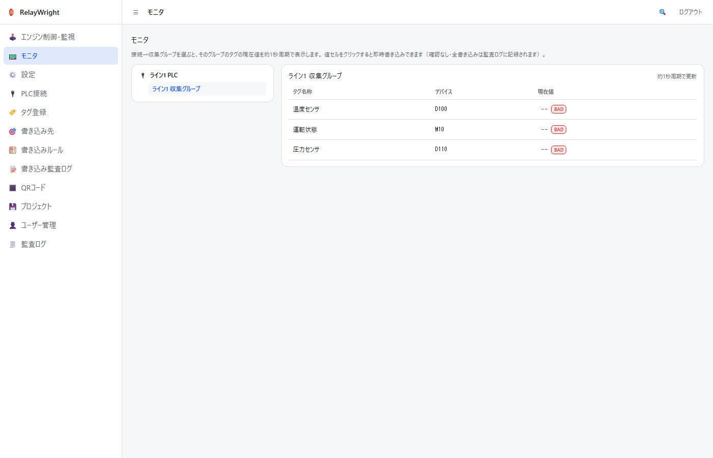
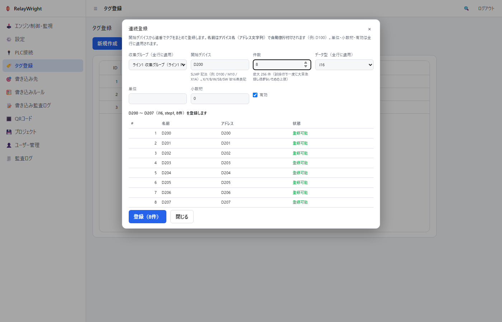
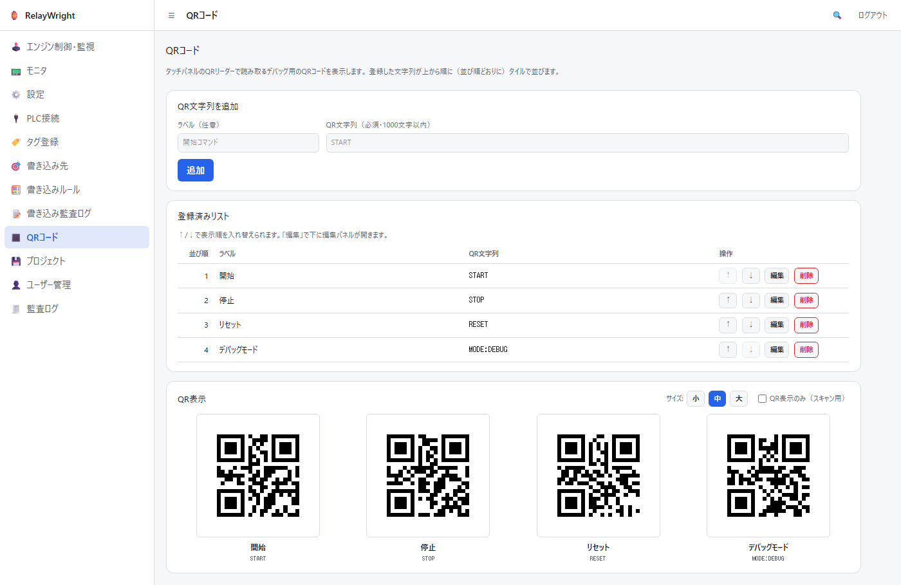
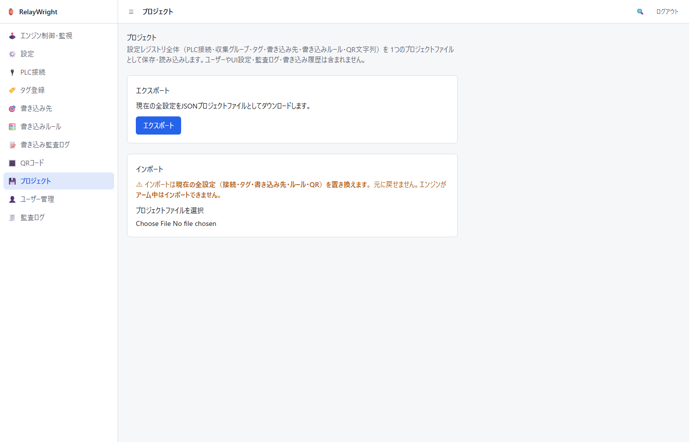

# RelayWright 取扱説明書

RelayWright（relay-wright）は、PLC から収集した値を条件に、別の PLC デバイスへ
自動的に値を書き込む Windows デスクトップアプリ（Tauri 製）です。本書は
インストールから日常運用までを画面写真つきで説明します。

> 本書のスクリーンショットは組み込み Web サーバー（LAN アクセス）経由の
> ブラウザ画面です。デスクトップアプリでも同一の画面構成ですが、一部
> デスクトップ専用の項目（ウィンドウ効果・LAN サーバー設定・自動ログイン・
> エンジン再構築）が追加で表示されます。

## 目次

1. [概要](#1-概要)
2. [安全上の注意](#2-安全上の注意)
3. [セットアップ](#3-セットアップ)
4. [画面ガイド](#4-画面ガイド)
5. [運用の流れ](#5-運用の流れ)
6. [現状の制限](#6-現状の制限)
7. [トラブルシューティング](#7-トラブルシューティング)

## 1. 概要

RelayWright は、登録した PLC デバイス（ソースタグ）の状態を周期監視し、
条件が成立した瞬間（エッジ検出）に別の PLC デバイス（書き込み先）へ
自動的に値を書き込みます。

- 対応プロトコル: MELSEC MC プロトコル（SLMP）/ Modbus TCP
- 例: 「温度センサ（D100）が 80 を超えたら、冷却バルブ指令（D200）に 1 を書く」
- 条件はルールごとに複数登録でき、すべて AND で判定されます
- すべての書き込み（および抑止・失敗）は書き込み監査ログに記録されます

安全設計として、書き込みを実際に行うかどうかは「アーム/非アーム」の
グローバルスイッチで制御します。**アプリは必ず非アーム（DISARMED）で
起動し**、前回終了時にアーム状態だったとしても自動では再開しません。

## 2. 安全上の注意

詳細は [README の「安全上の注意」](../README.md#安全上の注意) を必ずお読み
ください。要点は次のとおりです。

- **本アプリは稼働中の実 PLC へ自動的に値を書き込みます。** 設定ミスや
  不具合により意図しない機器動作が発生する可能性があります。
- 本番の設備・ラインへ投入する前に、**必ず本番外の設備やシミュレータで
  十分に動作検証**を行ってください（現時点で実機での動作検証は未実施です。
  [§6](#6-現状の制限) 参照）。
- アプリは**デフォルトで非アーム**です。アームは管理者が確認ダイアログを
  経て明示的に行う操作であり、インターロックや非常停止手段の確保など
  安全側の設計・運用は利用者の責任です。
- 本ソフトウェアは MIT ライセンスの下、**「現状のまま」・一切の保証なし**で
  提供されます。

## 3. セットアップ

### インストール

Windows 用インストーラ（NSIS 形式 `RelayWright_<version>_x64-setup.exe`、
または MSI 形式 `RelayWright_<version>_x64_en-US.msi`）を実行し、画面の
指示に従ってインストールします。

### 初回起動（管理者アカウントの作成）

初回起動時はデータベースにユーザーが存在しないため、管理者アカウントの
作成画面が表示されます。表示名・ユーザー名・パスワード（8 文字以上）を
入力して「アカウントを作成」を押してください。

### ログイン

2 回目以降の起動ではログイン画面が表示されます。作成したアカウントで
ログインしてください。LAN アクセス（ブラウザ）時のみ「ログイン状態を
保持する（30日間）」チェックボックスが表示されます。

## 4. 画面ガイド

サイドバーの構成は上から エンジン制御・監視 / モニタ / 設定 / PLC接続 /
タグ登録 / 書き込み先 / 書き込みルール / 書き込み監査ログ / QRコード /
プロジェクト / ユーザー管理 / 監査ログ です（ユーザー管理と監査ログは
管理者のみ表示）。

権限（ロール）は 3 段階です。

| ロール          | できること                                                                                                              |
| --------------- | ----------------------------------------------------------------------------------------------------------------------- |
| 閲覧者 (viewer) | 各画面の閲覧のみ                                                                                                        |
| 編集者 (editor) | + PLC接続/タグ/書き込み先/ルール/QR文字列の作成・編集・削除、ドライラン切替、モニタの手動書き込み（設定で有効化時のみ） |
| 管理者 (admin)  | + アーム/ディスアーム、エンジン再構築、ユーザー管理、監査ログ、設定管理（モニタ手動書き込みの有効化を含む）             |

### 4.1 エンジン制御・監視

自動書き込みエンジンの状態表示と操作を行う、運転員の中心画面です。

- **状態バッジ**: `ARMED（アーム中）`（赤）は条件成立時に実 PLC へ自動
  書き込みが行われる状態、`DISARMED（非アーム）`（緑）は物理書き込みが
  抑止されている状態です。
- **ドライランバッジ**: `ON` の間は書き込みを行わずログのみ記録します。
  アーム中でも実書き込みは行われません。
- **前回アーム状態の通知バナー**: 前回稼働時にアーム状態のまま終了した
  場合、画面上部に「前回の稼働時はアーム状態でした。安全のため再起動後は
  自動的に非アームで開始しています。必要なら手動でアームしてください。」
  というバナーが表示されます。自動では再アームされません。
- **アーム**: 押すと確認ダイアログ（OS 標準ダイアログのため本書には画面
  写真がありません）が表示されます。文言は「アームすると、条件成立時に
  実PLCへ自動的に値が書き込まれます。本当にアームしますか？」です。
  OK した場合のみアームされます。ディスアーム時も同様に確認ダイアログ
  （「エンジンをディスアームします（以後の物理書き込みを抑止します）。
  よろしいですか？」）が出ます。
- **エンジン再構築（リロード）**: 書き込み先・ルール・PLC 接続の変更を
  稼働中のエンジンに反映します。再構築後は必ず非アームで開始します。
  **デスクトップ版のみ**の機能で、ブラウザ（LAN）画面ではボタンが
  無効表示になります。
- 権限: アーム/ディスアーム/エンジン再構築は管理者のみ、ドライラン切替は
  編集者以上です。権限のないボタンは無効化されます。

### 4.2 モニタ（タグモニタ・デバッグ）

登録済みタグの現在値をリアルタイム表示し、その場で任意の値を書き込める
デバッグ画面です。

（上の画面例は PLC が未接続の環境で撮影したもので、全タグが `BAD` 表示に
なっています。実機接続時は現在値が約 1 秒周期で更新されます。）

- **左ペイン（ツリー）**: PLC接続 → 収集グループ の 2 階層です。収集
  グループをクリックすると、右側にそのグループのタグ一覧が表示されます。
  SLMP 以外（Modbus TCP）の接続はグレーアウトされ選択できません（モニタは
  エンジンの SLMP セッション経由で動作するため）。
- **右ペイン（タグ一覧）**: タグ名称 / デバイス（アドレス）/ 現在値（+単位）
  を**約 1 秒周期**で更新します。値はタグに設定したスケーリングと小数桁を
  適用した工学値（ルールエンジンが条件判定に使う値と同じ）です。読み取れ
  ないタグは `--` と `BAD` バッジで表示され、カーソルを合わせると理由
  （未接続・アドレス不正など）が表示されます。
- **手動書き込みは既定で無効です（要 設定での有効化）**: 誰かが気づかずに
  手動書き込みを使える状態を避けるため、「設定」画面（4.11）の
  「タグモニタ 手動書き込み」トグルで**管理者が明示的に有効化**しない限り、
  値セルはクリックできません（クリックできない理由がカーソルを合わせると
  表示されます）。有効化している間は画面上部に**常時警告バナー**
  （「⚠ 手動書き込みは安全ゲート対象外です」）が表示されます。トグルの
  変更は監査ログに記録されます。
- **クリックで即時書き込み（編集者以上・手動書き込みが有効な場合）**: 値
  セルをクリックするとインライン入力になり、**Enter で即時書き込み・Esc
  でキャンセル**です。bit タグは `0` / `1` ボタンのワンクリック書き込み
  になります。数値は工学値で入力します（スケーリング設定があれば生値へ
  逆変換して書き込み、整数型は最近傍へ丸めます）。文字列タグは Shift-JIS
  で `2 × 文字列長（語）` バイト以内のテキストを入力します。
- **確認ダイアログはありません**: 本アプリはデバッグ用途のため、有効化後の
  モニタの手動書き込みにはアーム操作も確認ダイアログも不要です（意図的な
  設計）。**disarm 中であっても、有効化されていれば手動書き込みは実行され
  ます**（アーム状態と手動書き込みの可否は無関係です）。そのかわり**全て
  の手動書き込み（失敗・不正値も含む）は書き込み監査ログに `手動書き込み`
  として記録**され、誰が・どのデバイスへ・何を書いたかがデバッグ履歴として
  残ります（無効化されている間の書き込み試行は拒否され、拒否も監査ログに
  記録されます）。稼働中の設備に対しては通常の安全上の注意
  （[§2](#2-安全上の注意)）がそのまま適用されます。
- **PLC セッションの共有**: MELSEC CPU（R08ENCPU 実機で確認）は SLMP の
  同時接続を同一ポートにつき 1 本しか受け付けないため、モニタは独自に
  PLC へ接続せず、自動書き込みエンジンが保持する接続（1 ポート = 1
  セッション）を共有して
  読み書きします。このためエンジンが起動していない場合はモニタも値を
  取得できず、画面上部にその旨のバナーが表示されます（エンジン制御画面
  から再構築するか、アプリを再起動してください）。エンジンのルールが
  参照していない接続でも、モニタが要求した時点でセッションが自動的に
  張られます。なお、PLC接続のホスト/ポートを**編集**した場合、張られて
  いる既存セッションには反映されません — エンジン再構築（またはアプリ
  再起動）後に新しい接続先が使われます（他の接続利用箇所と同じ挙動）。
- 権限: 閲覧は全ロール、書き込みは編集者以上**かつ手動書き込みが設定で
  有効化されている場合のみ**です（閲覧者には値セルの編集が表示されません。
  編集者以上でも、無効化されている間は編集できず理由が表示されます）。
  手動書き込み自体の有効/無効の切替は管理者のみです（「設定」画面、4.11）。

### 4.3 PLC接続

収集グループ・タグ・書き込み先が参照する PLC エンドポイント
（ホスト・ポート）の登録画面です。まずここに接続を登録してから、
タグや書き込み先を作成します。

- 上段の「新規作成」フォームで名前・プロトコル
  （`SLMP（MELSEC MCプロトコル）` / `Modbus TCP` のプルダウン）・
  ホスト・ポート・ユニット ID・有効を入力して作成します。
- **ユニット ID** は Modbus 用のスレーブ ID（0〜255）です。SLMP では
  未使用のため、既定値 1 のままで構いません。
- **本アプリのエンジンがポーリング／書き込みするのは SLMP 接続のみ**です。
  Modbus TCP は共有レジストリ（他アプリ用）として登録できますが、
  本アプリのエンジンからは使用されません。
- 一覧の行をクリックすると下に編集パネルが開き、保存・削除ができます。
  一覧の右端の「削除」列からも 1 クリックで削除できます。
- **削除はカスケード削除**です。接続を削除すると、その接続に属する
  収集グループとタグも**一緒に削除**されます。確認ダイアログに巻き添えの
  件数（「収集グループ N 件・タグ M 件も削除されます」）が表示されるので、
  内容を確認してから OK してください。削除後はトーストにも削除件数が
  表示されます。
- この接続を参照している**書き込み先（および関連ルール）は削除されません**
  が、参照先を失って無効になります（件数が確認ダイアログに表示されます）。
  別の接続に付け替えるか、不要なら書き込み先画面から削除してください。
- カスケード削除は登録（レジストリ）を消すだけで、**稼働中のエンジンが
  コンパイル済みのルールには再構築まで影響しません**。削除後はエンジン
  制御画面の「リロード（再構築）」で反映してください。

### 4.4 タグ登録

書き込みルールの条件・コピー元が参照するソースタグの登録画面です。
一覧（リスト）が画面の主役で、登録・編集はポップアップで行います。
タグが所属する収集グループの管理もこの画面で行います。

- **新規作成**: ツールバーの「新規作成」ボタンでタグ入力のポップアップ
  が開きます。名前・収集グループ（「グループ名（接続名）」形式の
  プルダウン）・アドレス・データ型（bit/i16/u16/i32/u32/f32/文字列
  (string)）・単位・小数桁などを入力します。
- **編集**: 一覧の行をクリックすると同じポップアップが既存値入りで
  開き、保存・削除ができます。ポップアップは Esc キーでも閉じられます。
- **行ごとの削除**: 一覧の右端の「削除」列をクリックすると、確認 1 回で
  そのタグを削除できます（ポップアップを開く必要はありません）。
- **選択削除（複数まとめて削除）**: 一覧の左端の「選択」列（☐/☑）を
  クリックしてタグを複数選択すると、ツールバーに「選択削除（N件）」
  ボタンが現れます。確認 1 回で選択した全タグを削除します（1 件ずつ
  監査ログに記録され、途中の行が失敗しても残りは続行して「成功N件・
  失敗M件」で通知されます）。ツールバーの「全選択（表示中）」で、
  現在の絞り込み・並び替え結果の全行をまとめて選択／解除できます。
- **アドレス**は SLMP 記法で入力します（例: `D100` / `M10` / `X1A`）。
- **文字列 (string) タグ**: データ型に「文字列(string)」を選ぶと、
  **文字列長（1〜128 ワード）** の入力欄が現れます（1 ワード = 2 バイト、
  Shift-JIS）。文字列タグはワードデバイス（`D` など）に置き、SJIS で
  格納された文字列を読み書きします。文字列タグではスケーリング・
  しきい値は設定できません（意味を持たないため入力欄は隠れ、その旨の
  注記が表示されます）。一覧には「文字列長」列が表示されます。
- **スケーリング（raw/eng の上下限）**は 4 つすべて入力するか、すべて
  空にしてください（空 = スケーリングなし）。
- **しきい値 LL/L/H/HH** は LL ≤ L ≤ H ≤ HH の順で入力します
  （設定した項目のみ比較されます）。
- **収集グループ管理**: タグは必ずいずれかの収集グループ（PLC 接続への
  所属単位）に属します。ツールバーの「収集グループ管理」ボタンで開く
  ポップアップで一覧・作成・編集・削除ができます。PLC 接続は
  プルダウンで選択し、収集周期は 100ms〜1min の固定候補から選びます。
  **収集周期（period）は共有レジストリ上のメタデータ（他の収集アプリが
  使用）で、本アプリのエンジンは自前の固定間隔でポーリングするため、
  ここでは参考情報です。** グループの削除は**カスケード削除**で、所属
  タグも一緒に削除されます（確認ダイアログに「所属タグ M 件も削除
  されます」と件数が表示されます。削除されるタグを参照している書き込み
  ルールがあれば、その件数も警告されます — ルール自体は削除されません）。

#### 一括登録（貼り付け）

Excel や CSV で用意したタグをまとめて登録できます。ツールバーの
「一括登録（貼り付け）」でポップアップを開き、収集グループ（貼り付けた
全行に適用されます）を選んでから、表計算ソフトでコピーした行を
テキスト欄に貼り付けます。

- 列の順は **名前, アドレス, データ型, 単位, 小数桁, 文字列長** です。
  名前・アドレス・データ型は必須、単位は空欄可（空 = 単位なし）、
  小数桁は空欄 = 0（入力する場合は 0〜6 の整数）です。**文字列長
  （6 列目）は文字列 (string) 型のとき必須**（1〜128 語）で、数値型
  では空欄にします。
- 区切り文字は行ごとに自動判定します。タブを含む行はタブ区切り
  （Excel からのコピー）、含まない行はカンマ区切り（CSV）として
  解析します。
- 先頭行のデータ型セルが有効値（bit/i16/u16/i32/u32/f32/string）でない
  場合はヘッダー行（見出し）とみなして読み飛ばします。見出し付きのまま
  貼り付けて構いません。
- 貼り付けると下にプレビュー表が表示され、行ごとの検証結果
  （登録可能／エラー理由）と「○件中○件登録可能」の集計を登録前に
  確認できます。エラー行は赤色で強調されます。
- 「登録」を押すと 1 行ずつ登録されます（1 件ずつ監査ログに記録され
  ます）。途中の行が失敗（名前の重複など）しても残りの行は続行され、
  結果は「成功N件・失敗M件」で通知されます。失敗した行はエラー
  メッセージ付きでプレビューに残るので、修正してそのまま再実行でき
  ます（登録済みの行は再実行時にスキップされます）。
- スケーリング・しきい値は一括登録では設定されません。必要な場合は
  登録後に行クリックで編集してください。

#### 連続登録

デバイス連番でタグをまとめて登録できます。ツールバーの「連続登録」で
ポップアップを開き、収集グループ・開始デバイス（SLMP 記法。例:
`D100`）・件数・データ型・単位・小数桁・有効を入力します
（収集グループ〜有効は生成される全行に適用されます）。

- **名前はデバイス名（アドレス文字列）で自動割り付け**されます
  （例: 開始 `D100` なら名前も `D100`, `D101`, … になります）。
- デバイス番号の基数はデバイス種別で決まります。`X/Y/B/W/SB/SW`
  （および `DX/DY`）は **16進**（例: `X19` の次は `X1A`）、それ以外
  （`D/M/L` など）は **10進** で連番になります。16進は大文字で表記
  されます。
- **32bit 型（i32/u32/f32）は連続する2ワードを占有するため、アドレスは
  2番地刻み**で生成されます（例: `D100`, `D102`, `D104`, …）。
  bit・16bit 型は1番地刻みです。刻み幅はプレビューの要約
  （`step1` / `step2`）で確認できます。
- **文字列 (string) 型を選ぶと文字列長（1〜128 ワード）の欄が現れ、
  その占有ワード数ぶんアドレスを刻んで**生成します（例: 文字列長 4 語・
  開始 `D300` なら `D300`, `D304`, `D308`, …）。全行に同じ文字列長が
  適用されます。
- 件数は1回の操作につき **最大256件** です（件数欄の桁の打ち間違い等で
  一度に大量登録し過ぎないための上限。それ以上は複数回に分けて
  ください）。
- 開始デバイスが解釈できない場合・データ型とデバイス種別が合わない場合
  （ビットデバイスは `bit` のみ、ワードデバイスは `bit` 以外）・最終
  デバイス番号が SLMP の上限を超える場合は、登録前にインラインエラーで
  表示されます（最終判定は従来どおりサーバー側でも行われます）。
- 既存タグと同名になる行はプレビューで警告表示されます（該当行は
  サーバー側で重複エラーになります）。
- プレビューには生成される名前・アドレスの一覧と「D200 〜 D207（i16,
  step1, 8件）を登録します」形式の要約が表示されます。件数が多い場合は
  先頭10件と最終行のみ表示されます（登録に失敗した行は省略されず
  表示されます）。
- 「登録」を押すと一括登録（貼り付け）と同じく 1 行ずつ登録されます
  （1 件ずつ監査ログに記録されます）。途中の行が失敗しても残りの行は
  続行され、結果は「成功N件・失敗M件」で通知されます。失敗した行は
  エラーメッセージ付きでプレビューに残り、再実行では未登録の行だけが
  送信されます。全行成功したときのみポップアップは自動で閉じます。
- スケーリング・しきい値は連続登録では設定されません。必要な場合は
  登録後に行クリックで編集してください。

### 4.5 書き込み先

ルールが値を書き込む PLC デバイス（アドレス）の登録画面です。

- 上段の「新規作成」フォームで名前・PLC 接続・アドレス（例: `D200`）・
  データ型（bit/i16/u16/i32/u32/f32/文字列(string)）・単位・小数桁・
  スケーリング（raw/eng の上下限。全て空欄 = スケーリングなし）を入力
  して作成します。
- **文字列 (string) 書き込み先**: データ型に「文字列(string)」を選ぶと
  **文字列長（1〜128 ワード）** の欄が現れます。文字列書き込み先には
  スケーリングを設定できません（入力欄は隠れ、その旨の注記が出ます）。
  一覧には「文字列長」列が表示されます。
- **PLC 接続**は [PLC接続画面](#42-plc接続) で登録済みの接続から
  「ID: 名前（プロトコル）」形式のプルダウンで選択します（数値 ID は
  監査ログの記録と突き合わせられるようラベルに含めています）。
  エンジンが実際に書き込むのは SLMP 接続のみです。
- 一覧の行をクリックすると下に編集パネルが開き、保存・削除ができます。

### 4.6 書き込みルール

「どの条件が成立したら、どこに何を書くか」を定義する画面です。

一覧の行をクリックすると編集パネルが開きます。条件はフォーム内に
インラインで編集します。

各フィールドの意味:

- **エッジモード**: 条件成立の検出方法です。
  - `立ち上がり` (rising): 条件が 不成立 → 成立 に変わった瞬間に 1 回発火
  - `立ち下がり` (falling): 条件が 成立 → 不成立 に変わった瞬間に 1 回発火
  - `変化時` (change): 成立状態が切り替わるたびに発火
- **クールダウン (ms)**: 発火後、次の発火まで最低この時間を空けます。
  空欄はクールダウンなしです。
- **書き込み先**: 登録済みの書き込み先からプルダウンで選択します。
- **書き込み値モード**:
  - `定数`: 「定数値」欄に入力した固定値を書き込みます。書き込み先が
    **文字列 (string)** のときは代わりに「定数（テキスト）」欄が現れ、
    書き込む文字列を入力します（Shift-JIS で最大 2×文字列長 バイト）。
  - `ソースタグをコピー`: 指定したソースタグの現在値をそのまま書き込みます
    （文字列→文字列のコピーは、コピー先の文字列長がコピー元以上である
    必要があります。文字列と数値をまたぐコピーはできません）。
- **条件（すべて AND で判定されます）**: 「+ 条件を追加」で行を増やせます。
  各行はソースタグ・演算子（=, ≠, >, ≥, <, ≤, between, bit_is）・
  しきい値（between のみ上限値も）からなり、全行が成立して初めてルールの
  条件成立と見なされます。
- **文字列 (string) ソースの条件**: 条件のソースタグに文字列タグを選ぶと、
  演算子は **`=`（等しい）・`≠`（等しくない）のみ** に絞られ、しきい値は
  **テキスト入力**（Shift-JIS で最大 2×文字列長 バイト）に切り替わります。
  比較は S1 の仕様どおり NUL 終端を取り除いた後の完全一致です（前後空白の
  除去や正規化は行いません）。読み取り品質が Bad の周期は成立とも不成立とも
  判定されません（そのルールは不定として発火しません）。
- **書き込みループ検出**: 「ルール A の書き込み先が別ルールの条件を成立
  させ、それがまた…」という循環につながる構成は保存時に検証され、
  エラーとして拒否されます。

> ソースタグ（条件・「ソースタグをコピー」の参照元）は
> [タグ登録画面](#43-タグ登録) で登録済みのタグから
> 「ID: 名前（アドレス）」形式のプルダウンで選択します（数値 ID は
> 監査ログの記録と突き合わせられるようラベルに含めています）。

### 4.7 書き込み監査ログ

エンジンが記録したすべての書き込み関連イベント（ルール発火・アーム/
ディスアーム・ドライラン切替・レート制限トリップ）の閲覧画面です。
行をクリックすると下に詳細（JSON 含む）が表示されます。

行の左端の色と「結果」列の読み方:

| 色  | 結果                                           | 意味                                                                           |
| --- | ---------------------------------------------- | ------------------------------------------------------------------------------ |
| 緑  | `書き込み成功` (ok)                            | 実際に PLC へ書き込んだ（またはアーム等の操作が完了した）                      |
| 赤  | `失敗` (failed)                                | 書き込みを試みたが失敗した（PLC 切断など）                                     |
| 赤  | `レート制限トリップ` (rate_limit_tripped)      | レート制限の上限に達し、ブレーカーが作動してエンジンが自動的に非アームになった |
| 灰  | `抑止（非アーム）` (suppressed_disarmed)       | 条件は成立したが、非アームのため書き込みを抑止した                             |
| 灰  | `抑止（ドライラン）` (suppressed_dry_run)      | ドライラン中のため書き込みを抑止した（ログのみ）                               |
| 灰  | `抑止（レート制限）` (suppressed_rate_limited) | レート制限により書き込みを抑止した                                             |

緑（実書き込み）と灰（意図的な抑止）と赤（要注意）を一目で区別できる
ように配色されています。赤い行を見つけたら詳細を確認してください。

### 4.8 QRコード（デバッグ支援）

タッチパネル（HMI）の QR リーダーに読ませる文字列をリストで管理し、
その QR コードを画面に並べて表示するデバッグ支援画面です。画面に表示した
QR をタッチパネルのリーダーで直接スキャンして、読み取り動作の確認や
コマンド投入のデバッグに使います。

- **QR文字列を追加**（編集者以上）: ラベル（任意・100 文字以内）と
  QR 文字列（必須・1000 文字以内）を入力して追加します。追加した行は
  リストの末尾に並びます。
  - 上限の 1000 文字は目安です。QR コードの容量はバイト数で決まるため、
    日本語など多バイト文字が多いと 1000 文字未満でも容量を超えることが
    あります。その場合は「QRコードに変換できません」という検証エラーに
    なるので、文字列を短くしてください。
- **登録済みリスト**: ↑/↓ボタンで表示順を入れ替えられます（並び順は
  保存され、QR 表示のタイル順に反映されます）。「編集」で下に編集
  パネルが開き、「削除」で確認のうえ削除します。閲覧者（viewer）は
  リストの閲覧と QR 表示のみで、追加・編集・削除・並び替えは編集者
  以上の権限が必要です。
- **QR表示**: 登録した文字列が並び順どおりにタイルで並び、各タイルの
  下にラベル（未設定なら文字列そのもの）が表示されます。
  - **サイズ切替（小/中/大）**: リーダーの読み取り距離や画面解像度に
    合わせてタイルの大きさ（128/192/256px）を切り替えられます。
  - **QR表示のみ（スキャン用）**: チェックすると管理セクションを隠して
    QR タイルだけを表示します。スキャン作業中の誤操作防止も兼ねます。
  - タイルの背景は常に白です（ダークモードでも QR コードは黒白でないと
    読み取れないため）。

### 4.9 監査ログ（操作監査）

書き込み以外の操作（ログイン/ログアウト、ユーザー・書き込み先・ルールの
作成/変更/削除、設定変更、バックアップ/リストア等）の監査証跡です。
管理者のみ閲覧できます。保持ポリシー（日数・上限行数）は「設定」画面で
変更できます。

### 4.10 ユーザー管理

ユーザーの作成・ロール変更・パスワードリセット・削除を行います。
管理者のみ利用できます。

### 4.11 設定

テーマ（ライト/ダーク/システム、スタンダード/ガラス）、LAN アクセス
（組み込み Web サーバー。デスクトップアプリでのみ変更可）、**タグモニタ
手動書き込みの有効/無効**（管理者のみ・既定は無効。「モニタ」画面、4.2
参照）、監査ログの保持ポリシー、バックアップ/リストア、自分のパスワード
変更を行います。デスクトップ版ではウィンドウ効果や自動ログインの設定も
表示されます。

### 4.12 プロジェクト（設定の保存・読み込み）

アプリの**設定レジストリ全体**を 1 つの JSON「プロジェクトファイル」として
保存（エクスポート）し、別の環境や別の時点の設定を読み込む（インポート）
画面です。対象は **PLC接続 / 収集グループ / タグ / 書き込み先 / 書き込み
ルール（条件を含む）/ QR文字列** です。ユーザー・UI設定（テーマ等）・監査
ログ・書き込み履歴・アーム状態は「設定」ではないため**含まれません**。

- **エクスポート**（編集者以上）: 「エクスポート」ボタンで現在の全設定を
  `relay-wright-project_YYYYMMDD.json` としてダウンロードします。ファイル内の
  ID は情報として保持されるだけで、読み込み時には振り直されます（秘密情報は
  含まれません）。
- **インポート**（管理者のみ）: ファイルを選ぶと、読み込む件数のプレビューが
  表示されます。実行すると**現在の全設定（接続・タグ・書き込み先・ルール・QR）
  がまるごと置き換わります**（元に戻せません）。取り込みは 1 つのトランザク
  ションで原子的に行われ、ファイル内の参照整合性・各行の妥当性・書き込み
  ループの循環が検証され、1 つでも不正があれば**何も適用されずに拒否**され
  ます。
- **安全ガード**: **エンジンがアーム中はインポートできません**（書き込み対象が
  変わるため）。インポート前に「エンジン制御・監視」でディスアームしてくだ
  さい。
- **反映にはエンジンの再読込が必要**: ルールはエンジン起動/再読込時にコンパイル
  されるため、インポートしたルールを有効にするにはエンジンを再読込します
  （デスクトップ版はインポート後に自動で再読込を試みます。LAN ブラウザから
  操作した場合は「エンジン制御・監視」で再読込するか、アプリを再起動して
  ください）。

## 5. 運用の流れ

初めて実運用に載せるまでの推奨手順です。

1. **登録**: 「PLC接続」→「タグ登録」（収集グループ → タグ）→
   「書き込み先」→「書き込みルール」の順に、すべて画面から登録します
   （サイドバーの並び順どおりです）。
2. **反映**: デスクトップ版で「エンジン再構築（リロード）」を実行し、
   登録内容をエンジンに読み込ませます（再構築後は非アームで開始）。
3. **ドライランで検証**: ドライランを ON にし（必要ならアームも行い）、
   実際の設備状態で条件が想定どおり成立するかを確認します。ドライラン中は
   一切書き込まれず、発火は `抑止（ドライラン）` として記録されます。
4. **監査ログで確認**: 書き込み監査ログで、想定したタイミング・値で
   発火しているか、想定外の発火がないかを確認します。
5. **非本番設備で実書き込み確認**: ドライランを OFF にしてアームし、
   本番外の設備・シミュレータで実際の書き込み動作を確認します。
6. **アーム（本運用）**: 検証が済んだらアームして運用を開始します。
   運用中も書き込み監査ログを定期的に確認してください。

### レート制限（暴走対策）について

エンジンには書き込みの暴走を防ぐレート制限が組み込まれています
（既定値: 60 秒間に全体で 30 回まで、1 つの PLC 接続あたり 10 回まで）。
上限を超える書き込みが発生しそうになると、**ブレーカーが作動して
エンジンは自動的に非アームになり**、`レート制限トリップ` の行が監査ログに
記録されます。**自動では復帰しません** — ルール設定（発振していないか、
クールダウンは適切か）を見直したうえで、手動で再アームしてください。

### アーム時限失効（自動ディスアーム）について

アームには**時限失効**もあります。既定でアームから **8 時間**
（設定キー `arm.auto_disarm_secs`、既定 28800 秒。`0` を設定すると
無効化できます）が経過すると、レート制限トリップと同様に**エンジンは
自動的に非アームになり**、監査ログに記録されます。長時間の連続運用では、
期限切れ後は改めて手動での再アームが必要です。

## 6. 現状の制限

- **設定変更の反映にはエンジン再構築が必要です。** 書き込み先・ルール・
  PLC 接続を変更しても、稼働中のエンジンには自動反映されません。
  デスクトップ版の「エンジン再構築（リロード）」を実行してください
  （LAN/ブラウザ経由では再構築できないため、アプリの再起動が必要です）。
- **実機（実 PLC）での動作検証は未実施です。** 現時点の検証は自動テストと
  シミュレータ相当の環境に限られます。実設備への適用は必ず
  [§2](#2-安全上の注意) の手順に従い、利用者の責任で検証してください。

## 7. トラブルシューティング

### エンジンが「not running」になる / 状態が取得できない

エンジンの起動に失敗すると、エンジン関連の操作は「not running」エラーを
返します。アプリ（またはサーバー）のログを確認のうえ再起動してください。
デスクトップ版ではエンジン再構築でも復帰できます。

### PLC に接続できない

PLC への接続が切れても、エンジンは自動的に再接続を試みます（1 秒から
最大 30 秒まで間隔を倍々に延ばす指数バックオフ）。接続断の間は該当接続の
タグ値が更新されないため、ルールは発火しません。書き込み中の切断は
`失敗` (failed) として監査ログに記録されます。ホスト/ポート設定、
ネットワーク、PLC 側の SLMP（MC プロトコル）設定を確認してください。

### 書き込みが起きない（発火しない）ときのチェックリスト

1. **アーム状態**: エンジン制御・監視画面で `ARMED` になっていますか。
   非アーム中の発火は `抑止（非アーム）` として記録されます。
2. **ドライラン**: ドライランが ON のままになっていませんか
   （`抑止（ドライラン）` の行が増えていきます）。
3. **ルールの有効フラグ**: 対象ルールの「有効」が「はい」になっていますか。
4. **条件とエッジモード**: 条件はすべて AND です。1 つでも不成立の条件が
   ないか、エッジモード（立ち上がり/立ち下がり/変化時）が意図と合って
   いるか確認してください。エッジ検出のため、「条件が成立し続けている」
   だけでは発火しません — 成立への*変化*が必要です。
5. **クールダウン / レート制限**: クールダウン中は発火しません。また
   レート制限がトリップすると自動的に非アームになります（`レート制限
トリップ` の行を確認。復帰は手動再アーム）。
6. **エンジンへの反映**: ルールを変更した後にエンジン再構築（または
   アプリ再起動）を行いましたか。
7. **監査ログの確認**: 最終的な事実はすべて書き込み監査ログに残ります。
   発火の記録自体がない場合は条件・タグ値・接続を、`抑止` や `失敗` の
   記録がある場合はその結果列と詳細（JSON）を確認してください。
