# RelayWright 取扱説明書

RelayWright（relay-wright）は、PLC から収集した値を条件に、別の PLC デバイスへ
自動的に値を書き込む Windows デスクトップアプリ（Tauri 製）です。本書は
インストールから日常運用までを画面写真つきで説明します。

> 本書のスクリーンショットは組み込み Web サーバー（LAN アクセス）経由の
> ブラウザ画面です。デスクトップアプリでも同一の画面構成ですが、一部
> デスクトップ専用の項目（ウィンドウ効果・LAN サーバー設定・自動ログイン・
> エンジン再構築）が追加で表示されます。

## 目次

1. [概要](#1-概要)
2. [安全上の注意](#2-安全上の注意)
3. [セットアップ](#3-セットアップ)
4. [画面ガイド](#4-画面ガイド)
5. [運用の流れ](#5-運用の流れ)
6. [現状の制限](#6-現状の制限)
7. [トラブルシューティング](#7-トラブルシューティング)

## 1. 概要

RelayWright は、登録した PLC デバイス（ソースタグ）の状態を周期監視し、
条件が成立した瞬間（エッジ検出）に別の PLC デバイス（書き込み先）へ
自動的に値を書き込みます。

- 対応プロトコル: MELSEC MC プロトコル（SLMP）/ Modbus TCP
- 例: 「温度センサ（D100）が 80 を超えたら、冷却バルブ指令（D200）に 1 を書く」
- 条件はルールごとに複数登録でき、すべて AND で判定されます
- すべての書き込み（および抑止・失敗）は書き込み監査ログに記録されます

安全設計として、書き込みを実際に行うかどうかは「アーム/非アーム」の
グローバルスイッチで制御します。**アプリは必ず非アーム（DISARMED）で
起動し**、前回終了時にアーム状態だったとしても自動では再開しません。

## 2. 安全上の注意

詳細は [README の「安全上の注意」](../README.md#安全上の注意) を必ずお読み
ください。要点は次のとおりです。

- **本アプリは稼働中の実 PLC へ自動的に値を書き込みます。** 設定ミスや
  不具合により意図しない機器動作が発生する可能性があります。
- 本番の設備・ラインへ投入する前に、**必ず本番外の設備やシミュレータで
  十分に動作検証**を行ってください（現時点で実機での動作検証は未実施です。
  [§6](#6-現状の制限) 参照）。
- アプリは**デフォルトで非アーム**です。アームは管理者が確認ダイアログを
  経て明示的に行う操作であり、インターロックや非常停止手段の確保など
  安全側の設計・運用は利用者の責任です。
- 本ソフトウェアは MIT ライセンスの下、**「現状のまま」・一切の保証なし**で
  提供されます。

## 3. セットアップ

### インストール

Windows 用インストーラ（NSIS 形式 `RelayWright_<version>_x64-setup.exe`、
または MSI 形式 `RelayWright_<version>_x64_en-US.msi`）を実行し、画面の
指示に従ってインストールします。

### 初回起動（管理者アカウントの作成）

初回起動時はデータベースにユーザーが存在しないため、管理者アカウントの
作成画面が表示されます。表示名・ユーザー名・パスワード（8 文字以上）を
入力して「アカウントを作成」を押してください。

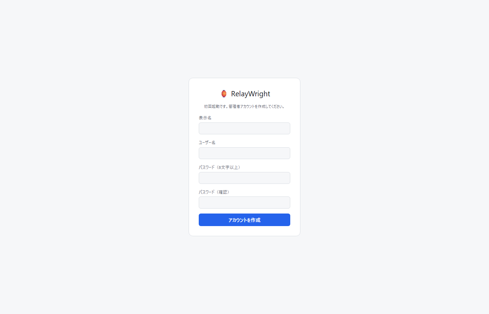

### ログイン

2 回目以降の起動ではログイン画面が表示されます。作成したアカウントで
ログインしてください。LAN アクセス（ブラウザ）時のみ「ログイン状態を
保持する（30日間）」チェックボックスが表示されます。

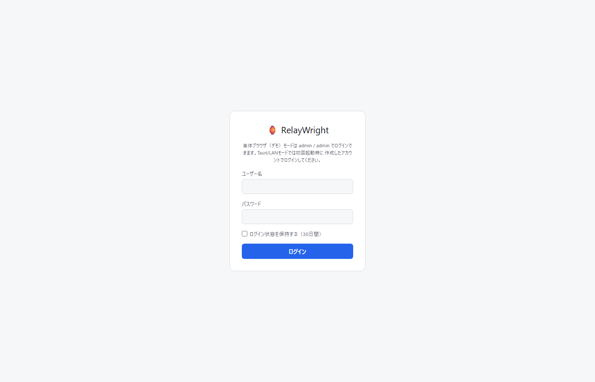

## 4. 画面ガイド

サイドバーの構成は上から エンジン制御・監視 / 設定 / PLC接続 / タグ登録 /
書き込み先 / 書き込みルール / 書き込み監査ログ / ユーザー管理 / 監査ログ です
（ユーザー管理と監査ログは管理者のみ表示）。

権限（ロール）は 3 段階です。

| ロール          | できること                                                              |
| --------------- | ----------------------------------------------------------------------- |
| 閲覧者 (viewer) | 各画面の閲覧のみ                                                        |
| 編集者 (editor) | + PLC接続/タグ/書き込み先/ルールの作成・編集・削除、ドライラン切替      |
| 管理者 (admin)  | + アーム/ディスアーム、エンジン再構築、ユーザー管理、監査ログ、設定管理 |

### 4.1 エンジン制御・監視

自動書き込みエンジンの状態表示と操作を行う、運転員の中心画面です。

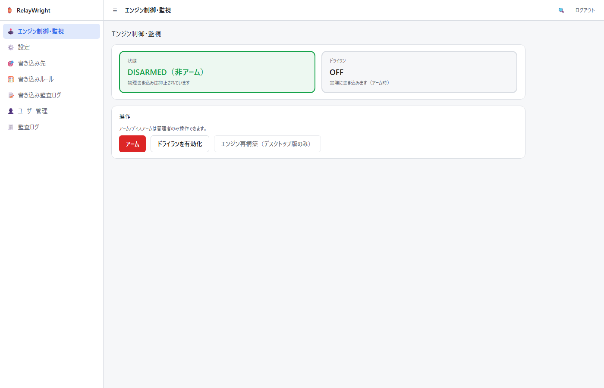

- **状態バッジ**: `ARMED（アーム中）`（赤）は条件成立時に実 PLC へ自動
  書き込みが行われる状態、`DISARMED（非アーム）`（緑）は物理書き込みが
  抑止されている状態です。
- **ドライランバッジ**: `ON` の間は書き込みを行わずログのみ記録します。
  アーム中でも実書き込みは行われません。
- **前回アーム状態の通知バナー**: 前回稼働時にアーム状態のまま終了した
  場合、画面上部に「前回の稼働時はアーム状態でした。安全のため再起動後は
  自動的に非アームで開始しています。必要なら手動でアームしてください。」
  というバナーが表示されます。自動では再アームされません。
- **アーム**: 押すと確認ダイアログ（OS 標準ダイアログのため本書には画面
  写真がありません）が表示されます。文言は「アームすると、条件成立時に
  実PLCへ自動的に値が書き込まれます。本当にアームしますか？」です。
  OK した場合のみアームされます。ディスアーム時も同様に確認ダイアログ
  （「エンジンをディスアームします（以後の物理書き込みを抑止します）。
  よろしいですか？」）が出ます。
- **エンジン再構築（リロード）**: 書き込み先・ルール・PLC 接続の変更を
  稼働中のエンジンに反映します。再構築後は必ず非アームで開始します。
  **デスクトップ版のみ**の機能で、ブラウザ（LAN）画面ではボタンが
  無効表示になります。
- 権限: アーム/ディスアーム/エンジン再構築は管理者のみ、ドライラン切替は
  編集者以上です。権限のないボタンは無効化されます。

### 4.2 PLC接続

収集グループ・タグ・書き込み先が参照する PLC エンドポイント
（ホスト・ポート）の登録画面です。まずここに接続を登録してから、
タグや書き込み先を作成します。

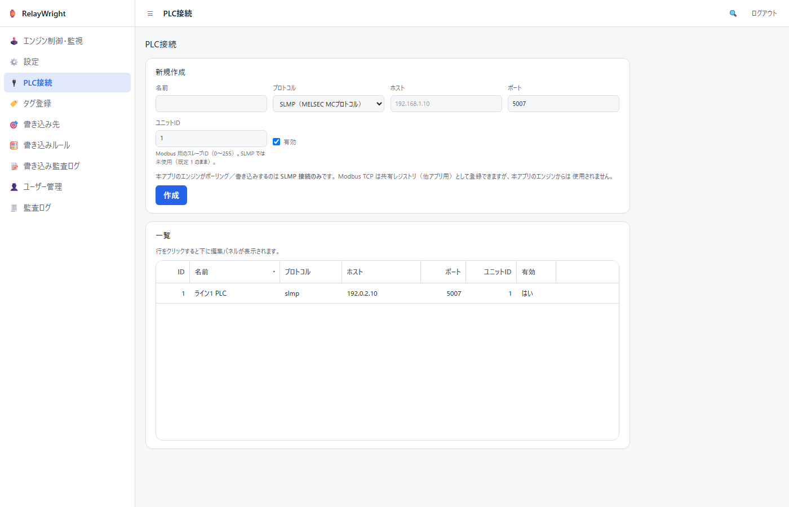

- 上段の「新規作成」フォームで名前・プロトコル
  （`SLMP（MELSEC MCプロトコル）` / `Modbus TCP` のプルダウン）・
  ホスト・ポート・ユニット ID・有効を入力して作成します。
- **ユニット ID** は Modbus 用のスレーブ ID（0〜255）です。SLMP では
  未使用のため、既定値 1 のままで構いません。
- **本アプリのエンジンがポーリング／書き込みするのは SLMP 接続のみ**です。
  Modbus TCP は共有レジストリ（他アプリ用）として登録できますが、
  本アプリのエンジンからは使用されません。
- 一覧の行をクリックすると下に編集パネルが開き、保存・削除ができます。
- 収集グループが参照している接続は削除できません（「…収集グループが
  N 件あるため削除できません」というエラーが表示されます）。先に
  参照元の収集グループを削除・付け替えしてください。

### 4.3 タグ登録

書き込みルールの条件・コピー元が参照するソースタグの登録画面です。
一覧（リスト）が画面の主役で、登録・編集はポップアップで行います。
タグが所属する収集グループの管理もこの画面で行います。

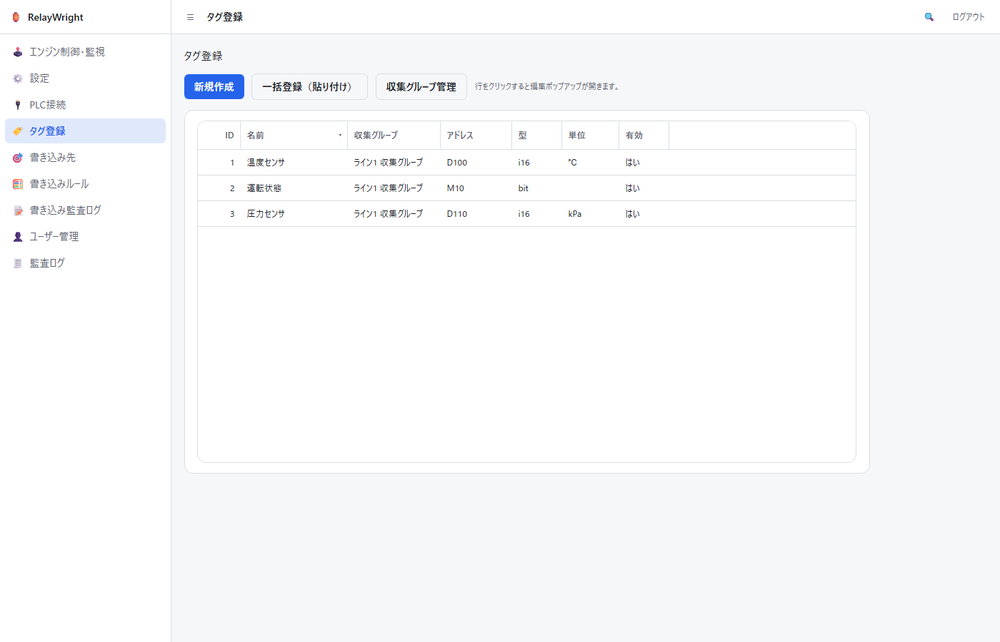

- **新規作成**: ツールバーの「新規作成」ボタンでタグ入力のポップアップ
  が開きます。名前・収集グループ（「グループ名（接続名）」形式の
  プルダウン）・アドレス・データ型（bit/i16/u16/i32/u32/f32）・単位・
  小数桁などを入力します。
- **編集**: 一覧の行をクリックすると同じポップアップが既存値入りで
  開き、保存・削除ができます。ポップアップは Esc キーでも閉じられます。
- **アドレス**は SLMP 記法で入力します（例: `D100` / `M10` / `X1A`）。
- **スケーリング（raw/eng の上下限）**は 4 つすべて入力するか、すべて
  空にしてください（空 = スケーリングなし）。
- **しきい値 LL/L/H/HH** は LL ≤ L ≤ H ≤ HH の順で入力します
  （設定した項目のみ比較されます）。
- **収集グループ管理**: タグは必ずいずれかの収集グループ（PLC 接続への
  所属単位）に属します。ツールバーの「収集グループ管理」ボタンで開く
  ポップアップで一覧・作成・編集・削除ができます。PLC 接続は
  プルダウンで選択し、収集周期は 100ms〜1min の固定候補から選びます。
  **収集周期（period）は共有レジストリ上のメタデータ（他の収集アプリが
  使用）で、本アプリのエンジンは自前の固定間隔でポーリングするため、
  ここでは参考情報です。** タグが所属しているグループは削除できません
  （件数入りのエラーが表示されます）。

#### 一括登録（貼り付け）

Excel や CSV で用意したタグをまとめて登録できます。ツールバーの
「一括登録（貼り付け）」でポップアップを開き、収集グループ（貼り付けた
全行に適用されます）を選んでから、表計算ソフトでコピーした行を
テキスト欄に貼り付けます。

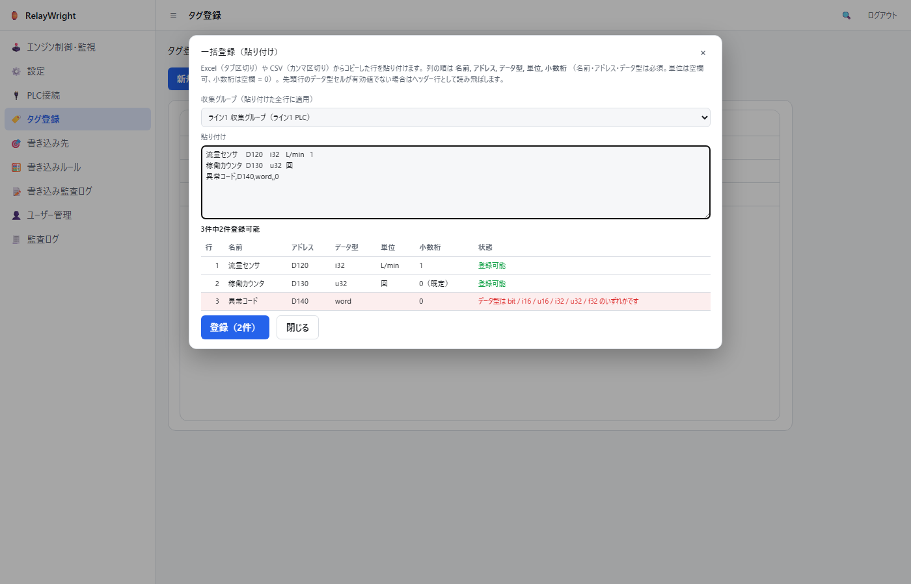

- 列の順は **名前, アドレス, データ型, 単位, 小数桁** です。
  名前・アドレス・データ型は必須、単位は空欄可（空 = 単位なし）、
  小数桁は空欄 = 0（入力する場合は 0〜6 の整数）です。
- 区切り文字は行ごとに自動判定します。タブを含む行はタブ区切り
  （Excel からのコピー）、含まない行はカンマ区切り（CSV）として
  解析します。
- 先頭行のデータ型セルが有効値（bit/i16/u16/i32/u32/f32）でない場合は
  ヘッダー行（見出し）とみなして読み飛ばします。見出し付きのまま
  貼り付けて構いません。
- 貼り付けると下にプレビュー表が表示され、行ごとの検証結果
  （登録可能／エラー理由）と「○件中○件登録可能」の集計を登録前に
  確認できます。エラー行は赤色で強調されます。
- 「登録」を押すと 1 行ずつ登録されます（1 件ずつ監査ログに記録され
  ます）。途中の行が失敗（名前の重複など）しても残りの行は続行され、
  結果は「成功N件・失敗M件」で通知されます。失敗した行はエラー
  メッセージ付きでプレビューに残るので、修正してそのまま再実行でき
  ます（登録済みの行は再実行時にスキップされます）。
- スケーリング・しきい値は一括登録では設定されません。必要な場合は
  登録後に行クリックで編集してください。

### 4.4 書き込み先

ルールが値を書き込む PLC デバイス（アドレス）の登録画面です。

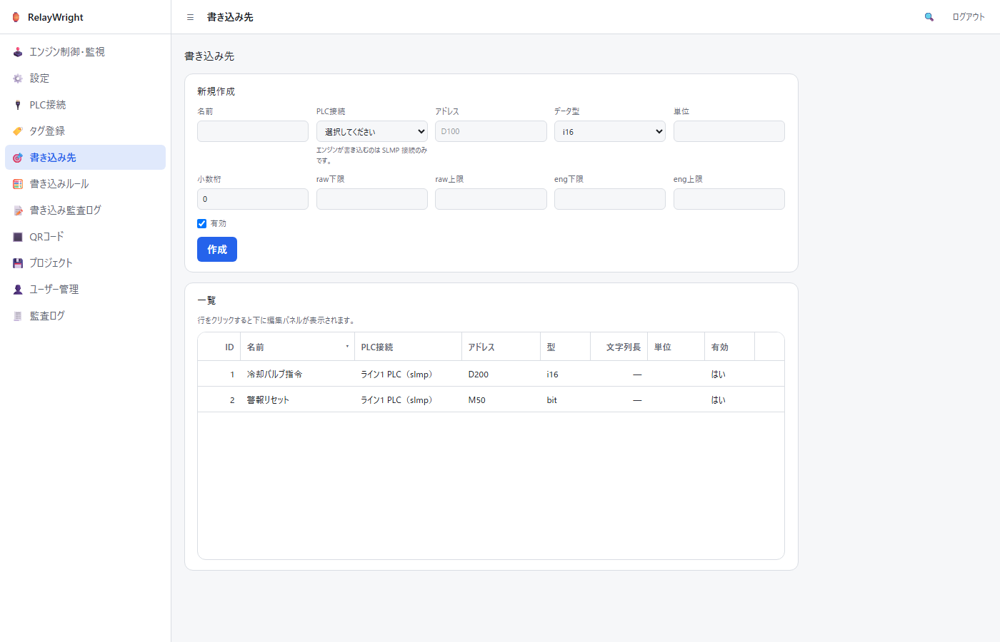

- 上段の「新規作成」フォームで名前・PLC 接続・アドレス（例: `D200`）・
  データ型（bit/i16/u16/i32/u32/f32）・単位・小数桁・スケーリング
  （raw/eng の上下限。全て空欄 = スケーリングなし）を入力して作成します。
- **PLC 接続**は [PLC接続画面](#42-plc接続) で登録済みの接続から
  「ID: 名前（プロトコル）」形式のプルダウンで選択します（数値 ID は
  監査ログの記録と突き合わせられるようラベルに含めています）。
  エンジンが実際に書き込むのは SLMP 接続のみです。
- 一覧の行をクリックすると下に編集パネルが開き、保存・削除ができます。

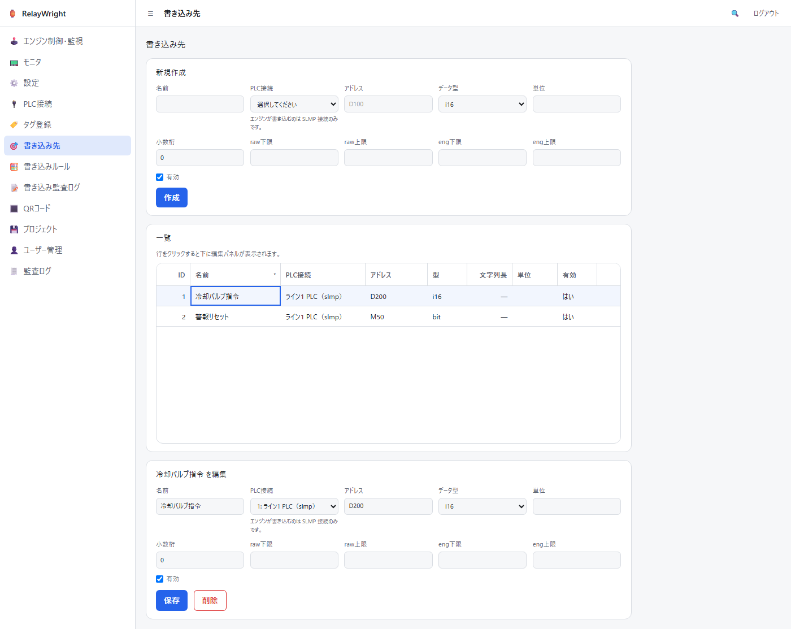

### 4.5 書き込みルール

「どの条件が成立したら、どこに何を書くか」を定義する画面です。

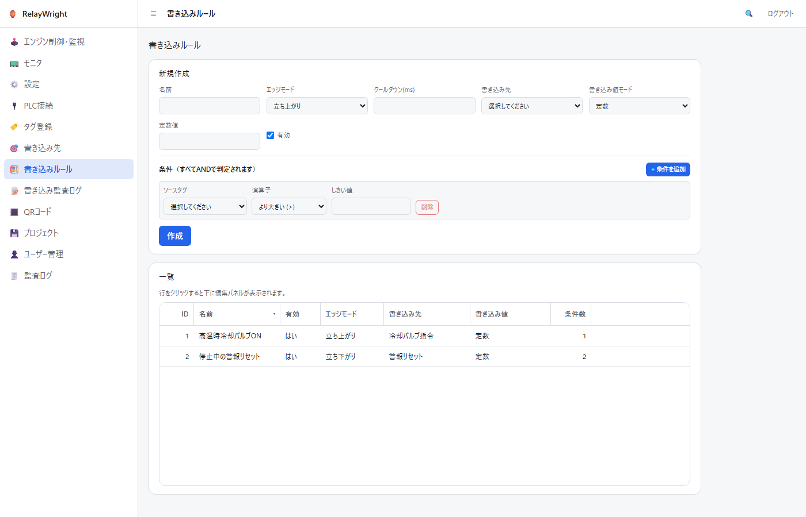

一覧の行をクリックすると編集パネルが開きます。条件はフォーム内に
インラインで編集します。

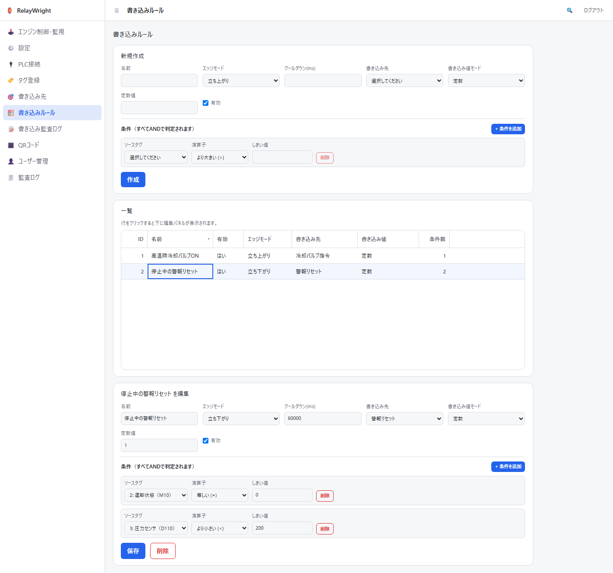

各フィールドの意味:

- **エッジモード**: 条件成立の検出方法です。
  - `立ち上がり` (rising): 条件が 不成立 → 成立 に変わった瞬間に 1 回発火
  - `立ち下がり` (falling): 条件が 成立 → 不成立 に変わった瞬間に 1 回発火
  - `変化時` (change): 成立状態が切り替わるたびに発火
- **クールダウン (ms)**: 発火後、次の発火まで最低この時間を空けます。
  空欄はクールダウンなしです。
- **書き込み先**: 登録済みの書き込み先からプルダウンで選択します。
- **書き込み値モード**:
  - `定数`: 「定数値」欄に入力した固定値を書き込みます
  - `ソースタグをコピー`: 指定したソースタグの現在値をそのまま書き込みます
- **条件（すべて AND で判定されます）**: 「+ 条件を追加」で行を増やせます。
  各行はソースタグ・演算子（=, ≠, >, ≥, <, ≤, between, bit_is）・
  しきい値（between のみ上限値も）からなり、全行が成立して初めてルールの
  条件成立と見なされます。
- **書き込みループ検出**: 「ルール A の書き込み先が別ルールの条件を成立
  させ、それがまた…」という循環につながる構成は保存時に検証され、
  エラーとして拒否されます。

> ソースタグ（条件・「ソースタグをコピー」の参照元）は
> [タグ登録画面](#43-タグ登録) で登録済みのタグから
> 「ID: 名前（アドレス）」形式のプルダウンで選択します（数値 ID は
> 監査ログの記録と突き合わせられるようラベルに含めています）。

### 4.6 書き込み監査ログ

エンジンが記録したすべての書き込み関連イベント（ルール発火・アーム/
ディスアーム・ドライラン切替・レート制限トリップ）の閲覧画面です。
行をクリックすると下に詳細（JSON 含む）が表示されます。

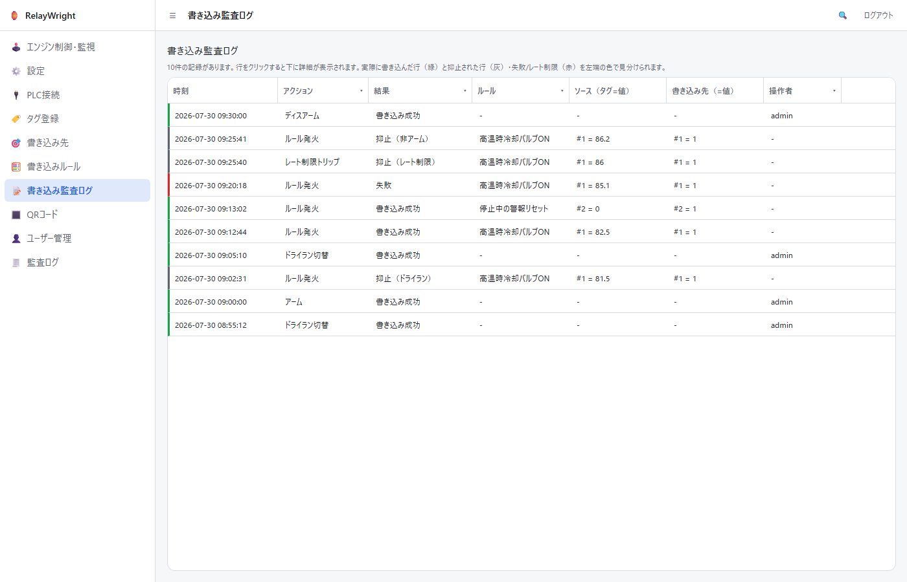

行の左端の色と「結果」列の読み方:

| 色  | 結果                                           | 意味                                                                           |
| --- | ---------------------------------------------- | ------------------------------------------------------------------------------ |
| 緑  | `書き込み成功` (ok)                            | 実際に PLC へ書き込んだ（またはアーム等の操作が完了した）                      |
| 赤  | `失敗` (failed)                                | 書き込みを試みたが失敗した（PLC 切断など）                                     |
| 赤  | `レート制限トリップ` (rate_limit_tripped)      | レート制限の上限に達し、ブレーカーが作動してエンジンが自動的に非アームになった |
| 灰  | `抑止（非アーム）` (suppressed_disarmed)       | 条件は成立したが、非アームのため書き込みを抑止した                             |
| 灰  | `抑止（ドライラン）` (suppressed_dry_run)      | ドライラン中のため書き込みを抑止した（ログのみ）                               |
| 灰  | `抑止（レート制限）` (suppressed_rate_limited) | レート制限により書き込みを抑止した                                             |

緑（実書き込み）と灰（意図的な抑止）と赤（要注意）を一目で区別できる
ように配色されています。赤い行を見つけたら詳細を確認してください。

### 4.7 監査ログ（操作監査）

書き込み以外の操作（ログイン/ログアウト、ユーザー・書き込み先・ルールの
作成/変更/削除、設定変更、バックアップ/リストア等）の監査証跡です。
管理者のみ閲覧できます。保持ポリシー（日数・上限行数）は「設定」画面で
変更できます。

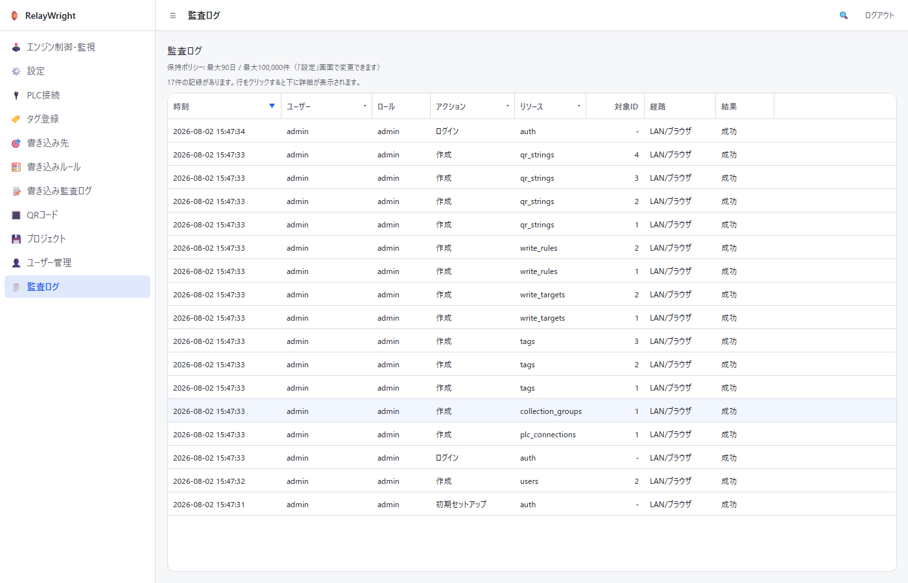

### 4.8 ユーザー管理

ユーザーの作成・ロール変更・パスワードリセット・削除を行います。
管理者のみ利用できます。

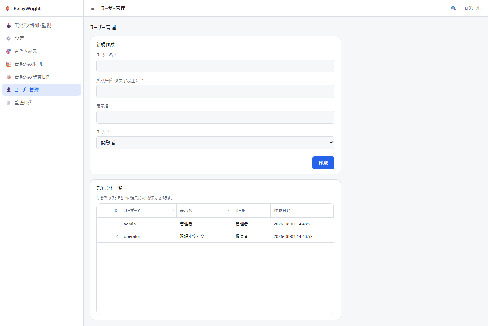

### 4.9 設定

テーマ（ライト/ダーク/システム、スタンダード/ガラス）、LAN アクセス
（組み込み Web サーバー。デスクトップアプリでのみ変更可）、監査ログの
保持ポリシー、バックアップ/リストア、自分のパスワード変更を行います。
デスクトップ版ではウィンドウ効果や自動ログインの設定も表示されます。

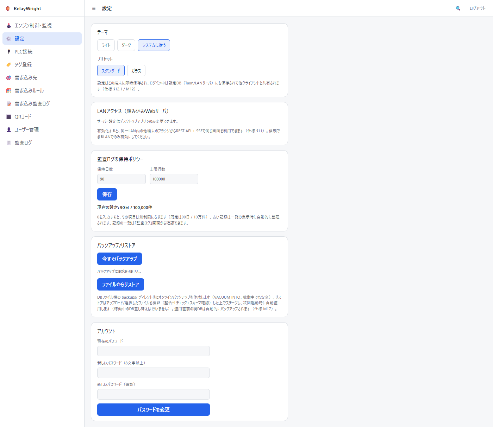

## 5. 運用の流れ

初めて実運用に載せるまでの推奨手順です。

1. **登録**: 「PLC接続」→「タグ登録」（収集グループ → タグ）→
   「書き込み先」→「書き込みルール」の順に、すべて画面から登録します
   （サイドバーの並び順どおりです）。
2. **反映**: デスクトップ版で「エンジン再構築（リロード）」を実行し、
   登録内容をエンジンに読み込ませます（再構築後は非アームで開始）。
3. **ドライランで検証**: ドライランを ON にし（必要ならアームも行い）、
   実際の設備状態で条件が想定どおり成立するかを確認します。ドライラン中は
   一切書き込まれず、発火は `抑止（ドライラン）` として記録されます。
4. **監査ログで確認**: 書き込み監査ログで、想定したタイミング・値で
   発火しているか、想定外の発火がないかを確認します。
5. **非本番設備で実書き込み確認**: ドライランを OFF にしてアームし、
   本番外の設備・シミュレータで実際の書き込み動作を確認します。
6. **アーム（本運用）**: 検証が済んだらアームして運用を開始します。
   運用中も書き込み監査ログを定期的に確認してください。

### レート制限（暴走対策）について

エンジンには書き込みの暴走を防ぐレート制限が組み込まれています
（既定値: 60 秒間に全体で 30 回まで、1 つの PLC 接続あたり 10 回まで）。
上限を超える書き込みが発生しそうになると、**ブレーカーが作動して
エンジンは自動的に非アームになり**、`レート制限トリップ` の行が監査ログに
記録されます。**自動では復帰しません** — ルール設定（発振していないか、
クールダウンは適切か）を見直したうえで、手動で再アームしてください。

## 6. 現状の制限

- **設定変更の反映にはエンジン再構築が必要です。** 書き込み先・ルール・
  PLC 接続を変更しても、稼働中のエンジンには自動反映されません。
  デスクトップ版の「エンジン再構築（リロード）」を実行してください
  （LAN/ブラウザ経由では再構築できないため、アプリの再起動が必要です）。
- **実機（実 PLC）での動作検証は未実施です。** 現時点の検証は自動テストと
  シミュレータ相当の環境に限られます。実設備への適用は必ず
  [§2](#2-安全上の注意) の手順に従い、利用者の責任で検証してください。

## 7. トラブルシューティング

### エンジンが「not running」になる / 状態が取得できない

エンジンの起動に失敗すると、エンジン関連の操作は「not running」エラーを
返します。アプリ（またはサーバー）のログを確認のうえ再起動してください。
デスクトップ版ではエンジン再構築でも復帰できます。

### PLC に接続できない

PLC への接続が切れても、エンジンは自動的に再接続を試みます（1 秒から
最大 30 秒まで間隔を倍々に延ばす指数バックオフ）。接続断の間は該当接続の
タグ値が更新されないため、ルールは発火しません。書き込み中の切断は
`失敗` (failed) として監査ログに記録されます。ホスト/ポート設定、
ネットワーク、PLC 側の SLMP（MC プロトコル）設定を確認してください。

### 書き込みが起きない（発火しない）ときのチェックリスト

1. **アーム状態**: エンジン制御・監視画面で `ARMED` になっていますか。
   非アーム中の発火は `抑止（非アーム）` として記録されます。
2. **ドライラン**: ドライランが ON のままになっていませんか
   （`抑止（ドライラン）` の行が増えていきます）。
3. **ルールの有効フラグ**: 対象ルールの「有効」が「はい」になっていますか。
4. **条件とエッジモード**: 条件はすべて AND です。1 つでも不成立の条件が
   ないか、エッジモード（立ち上がり/立ち下がり/変化時）が意図と合って
   いるか確認してください。エッジ検出のため、「条件が成立し続けている」
   だけでは発火しません — 成立への*変化*が必要です。
5. **クールダウン / レート制限**: クールダウン中は発火しません。また
   レート制限がトリップすると自動的に非アームになります（`レート制限
トリップ` の行を確認。復帰は手動再アーム）。
6. **エンジンへの反映**: ルールを変更した後にエンジン再構築（または
   アプリ再起動）を行いましたか。
7. **監査ログの確認**: 最終的な事実はすべて書き込み監査ログに残ります。
   発火の記録自体がない場合は条件・タグ値・接続を、`抑止` や `失敗` の
   記録がある場合はその結果列と詳細（JSON）を確認してください。
