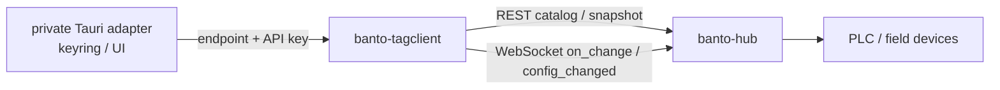
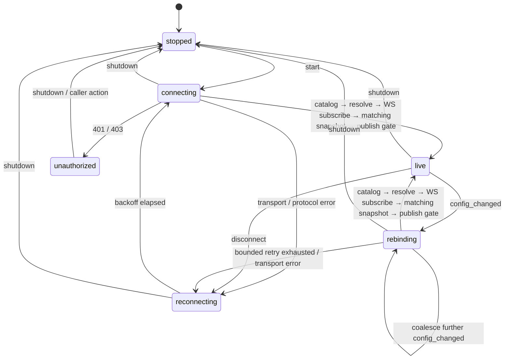

# banto-tagclient 設計

作成日: 2026-08-29
状態: **S4a・W1完了（2026-09-01）、S4統合ゲート1〜4完了（2026-09-02、§7.1）**。
S4統合ゲートの5項目（本書§7冒頭）のうち、依存グラフ・license/保守状況・Windows配布
バイナリ増分・workspace feature整合の実測（1〜4）は完了した。**5（Hubのrelease tag
または互換commitへの固定方法）はオーナー決定待ちで未完**であり、S4自体はまだ
完了していない。S1bのREST catalog/values transport、S2aの
Hub WS wire純粋解析・bounded pending map・latest-wins publish gate・非LIVE current抑止に加え、
S2b-1の認証付きWebSocket handshake、S2b-2aのon_change subscribe送信と1フレーム受信、
S2b-2bのcrate-private単一世代worker・tokio watchによるlatest snapshot配信・atomic publishを
実装した。S3aでは公開Handle、worker所有権、明示shutdown、Drop時の非同期処理なしabortを
実装した。S3b-1ではcatalog起点の逐次再接続、指数backoff、停止割り込みを実装し、S3b-2ではconfig_changed再bind、revision/runtime metadataの再解決、coalesceを実装した（2026-08-31）。
S4aでは、資格情報を複製せず旧世代を停止・joinしてから置換RestClientで再開始する、消費型の公開`restart`を実装した（2026-09-01）。
S4b-1互換候補では、`origin/main` 509bf0e（Banto v1.4.0）との統合検証で
`tokio-tungstenite`を0.29系へ一本化できることをローカルに確認した。Issue #199の
解消は未push・未mergeの候補上の確認であり、Issue自体は完了扱いにしない。実Hub/LAN接続、
配布サイズ、release tag、private appへの固定は未完で、RTSPの別worktree/別履歴も含めない。
**W1（2026-09-01）**では、Issue #123の残スコープだった単一タグ書き込み
（`RestClient::write_tag`）を実装した。stable IDから外部名を都度re解決し、
`POST /api/v1/values/{tag}`を1回送るだけで、`worker.rs`の再接続・backoff機構には
一切乗せない（自動再送をしない、§4.4のオーナー決定）。バッチ・レシピ書き込みは
実装していない（同§のオーナー決定）。
設計時参照baseline: `b9552627a86015b354b3c5651184fb108ba89e44`
実API確認日: 2026-08-30（`apps/banto-hub/core/src/rest.rs` / `stream.rs`）、
書き込み経路は2026-09-01に`apps/banto-hub/core/src/rest.rs`の`v1_write_value`・
`apps/banto-hub/core/src/write_path.rs`の`execute_write`/`WriteRejection`で再確認

---

## 0. 目的と非スコープ

`banto-tagclient` は、アプリケーションが banto-hub のcatalogから安定IDでタグを
解決し、現在値を取得・購読・（単一タグに限り）書き込みするための Rust crate である。
PLC、Modbus、SLMPへは直接接続しない。タグ定義と品質判定の一次ソースは常に banto-hub
とする。

初版の対象は次に限る。

- RESTによるcatalogと明示タグの初期snapshot取得
- WebSocketによる`on_change`購読と`config_changed`検知
- stable IDを用いたbindingの解決・再解決
- 最新値優先のアプリ内状態配信と停止可能な接続ライフサイクル
- **W1（2026-09-01）**: stable IDを指定した単一タグのREST書き込み
  （`RestClient::write_tag`）。詳細・オーナー決定は§4.4。

次は初版の非スコープである。

- **バッチ・レシピ書き込み**（複数タグをまとめて1回で書く操作）: §4.4の
  オーナー決定（2026-09-01）により、実要件が出るまで見送る
- PLC直接接続、タグ設定の変更
- MQTT、gRPC、履歴照会、認可方式の変更
- OS keyring、Tauri command、画面、案件固有のタグ名・ID・接続設定
- 実機値が失われた場合のdemo値への自動フォールバック

## 1. 位置づけと境界



- `banto-tagclient` はTauri、Svelte、OS keyring、案件設定を知らない。
- private側adapterがkeyringからAPI keyを取得し、SDKへ渡す。SDKはkeyringを所有しない。
- API keyは `Authorization: Bearer <token>` ヘッダだけで送る。URL queryへ入れない。
- S1b RESTは自動system/environment proxyを無効化し、設定endpointへ直接接続する。redirectも追従しない。
- endpointは初版では`http`/`ws`のみとする（`https`/`wss`は別設計）。URLは
  userinfo、query、fragmentを必ず拒否し、HTTP redirectも追従しない。hostは空でない
  DNS名またはIP、portは省略または1..=65535、pathはorigin-formの絶対path（必要なら
  `/api/v1`等の固定prefix）だけを許可し、pathに資格情報を置かない。SDKは接続先の
  scheme/host/port/pathをこの境界内で固定してREST/WSを組み立てる。
- SDKから返す接続状態、値、未解決状態は、UIが現在値と誤認しないよう区別する。

## 2. transport選定

初版はREST + WebSocketを採用する。

| 用途                          | transport                  | 理由                                                                                                             |
| ----------------------------- | -------------------------- | ---------------------------------------------------------------------------------------------------------------- |
| catalog取得、明示タグの初期値 | REST                       | 再接続時も含め、要求と応答を明確に対応できる。                                                                   |
| 値の継続受信                  | WebSocket `on_change`      | 最新値を低遅延で更新できる。                                                                                     |
| binding再解決の契機           | WebSocket `config_changed` | stable ID bindingのrevision変更をHub変更なしで即時検知できる。                                                   |
| gRPC                          | 初版不採用                 | Hub側`ValueBatch`にrevision / `config_changed`相当がない。catalog pollingかproto拡張の設計が固まるまで保留する。 |

RESTだけの定期pollingは、rename・rebind・削除を検知するまでの遅延を作る。WebSocketの
`config_changed`を利用し、構成変更時だけcatalogを取り直すことで、この遅延を持ち込まない。

## 3. データ契約

### 3.1 binding

アプリは案件固有の外部名ではなく、次のstable IDとアプリ内のbinding keyを保存する。

```rust
pub struct StableTagId {
	pub connection_id: i64,
	pub group_id: i64,
	pub tag_id: i64,
}

pub struct BindingRequest {
	pub binding_key: String,
	pub stable_id: StableTagId,
}
```

`external_name`はcatalogから都度解決する表示用・購読用情報であり、bindingの同一性には
用いない。public文書・fixtureに案件固有のtag名、tag ID、接続情報を入れない。

要求`BindingRequest`の`binding_key`重複、stable ID三つ組の重複、catalog内のstable ID
重複は全てfail-closedとする。部分的にbindingを作らず、安定分類
`duplicate_binding_key` / `duplicate_requested_stable_id` / `duplicate_catalog_stable_id`
（実装では`invalid_bindings`または`invalid_catalog`の下位理由としてもよい）で返す。

### 3.2 値と未解決

```rust
pub enum ValueQuality {
	Good,
	Stale,
	Bad,
}

pub struct TagValueSnapshot {
	pub binding_key: String,
	pub numeric_value: Option<f64>,
	pub quality: ValueQuality,
	pub source_timestamp_ms: Option<i64>,
	pub received_at_ms: i64,
	pub catalog_revision: u64,
	pub run_id: Option<u64>,
	pub collection_mode: CollectionMode,
	pub value_source: ValueSource,
	pub unresolved: Option<UnresolvedReason>,
}
```

`numeric_value: None`、品質、時刻、未解決理由を混同しない。`received_at_ms`はSDKが受信した
時刻、`source_timestamp_ms`はHubから来た値の時刻である。再bindingに失敗した既存値は
保持してよいが、`unresolved`を設定してcurrent値として扱わない。

REST catalog DTOはHubの`revision`, `run_id`, `collection_mode`と各tagの`value_source`を
保持する。REST values/snapshot DTOも応答の`revision`, `run_id`, `collection_mode`と
各値の`value_source`を保持する（Hub実装のwire名はsnake_case）。値側entryの
`value_source`をauthoritativeな値源情報として保持し、catalog側の表示情報で上書きしない。

```rust
pub enum CollectionMode { Configured, AllSimulation, Unknown(String) }
pub enum ValueSource {
	Real,
	Simulation,
	DerivedSimulation,
	Internal,
	Unknown(String),
}
```

`value_source`の既知値は`real` / `simulation` / `derived_simulation` / `internal`。
未知値はraw値を保持した`Unknown(String)`として扱い、`Real`や実機のcurrentへ昇格させない。
`collection_mode`も未知値を`Unknown(String)`として保持するが、Unknownまたはcatalogと
valuesで異なる場合はcurrentを公開しない。catalogとvaluesは`revision`だけでなく
`run_id`（Optionの有無と値）と`collection_mode`も同一generationで一致しなければならない。
WS `data`にはrevision/source/run metadataがないため、最後に確定したREST snapshotの
metadataと、値側entryのauthoritativeな`value_source`をその接続世代へ固定する。
切断・再bindingでは必ずこのsnapshotを再取得し、旧世代のWS値を再利用しない。

## 4. 公開APIとエラー契約

S1bで確定した公開APIは次のとおりである。REST clientは自動system/environment proxyを無効化し、
設定endpointへ直接接続する（redirectも追従しない）。

```rust
pub struct RestClient { /* Endpoint + opaque SecretApiKey + reqwest Client */ }

impl RestClient {
	pub fn new(endpoint: Endpoint, secret: SecretApiKey) -> Result<Self>;
	pub async fn fetch_catalog(&self) -> Result<CatalogSnapshot>;
	pub async fn fetch_values(&self, tags: &[&str]) -> Result<ValuesSnapshot>;
	// W1（2026-09-01、Issue #123）: 単一タグ書き込み。§4.4参照。
	pub async fn write_tag(&self, stable_id: StableTagId, value: RequestedValue) -> Result<()>;
	pub fn start(self, requests: Vec<BindingRequest>) -> Result<TagClientHandle>;
}

// `write`モジュール（W1）。
pub enum RequestedValue {
	Num(f64),
	Bool(bool),
}

pub struct TagClientHandle { /* private stop/state/task ownership */ }

pub struct TagClientState { /* state, optional current, optional last_error */ }

impl TagClientHandle {
	pub fn state(&self) -> TagClientState;
	pub fn state_watch(&self) -> tokio::sync::watch::Receiver<TagClientState>;
	pub async fn shutdown(self) -> Result<()>;
	pub async fn restart(self, replacement: RestClient) -> Result<TagClientHandle>;
}
```

`fetch_values`は外部タグ名を単一の`tags=name1,name2` queryへエンコードし、空リストでも
`tags=`を送る。タグ名にカンマが含まれる場合は通信前に`invalid_tag_selection`でfail-closed
する。S3aの`start`は要求をspawn・通信前に検証し、現在のTokio runtime上で単一世代workerを所有する
`TagClientHandle`を返す。handleはclone不可で、`state`/`state_watch`だけを公開し、明示的な
`shutdown().await`で停止通知・WebSocket close・worker joinを行う。DropはblockせずStoppedを
通知してbest-effort abortする。worker失敗時は`TagClientState::last_error()`へ安定分類を残し、
shutdownはそのエラーを返す。公開Handleによるcatalog起点の再接続・retry、rebinding、retry拡張はS3bで扱う。
`restart(replacement)`はhandleとreplacement clientを消費し、旧workerの停止・WebSocket close・join完了後に
同じbinding要求で新世代を起動する。旧`state_watch`はcleanな`stopped`で終わり、返却された新Handleの
`state_watch`を購読する。restart futureのキャンセル時は旧handleのDropが残存workerをabortし、replacementも
通常のDropで破棄される。旧taskの`JoinError`/panicは`transport`として返し、新世代を起動しない。

`SecretApiKey`は明示的なopaque wrapperとする。crate-private APIは
`SecretApiKey::new(String) -> Result<SecretApiKey, SecretError>`と、SDK内部だけが使う
`apply_authorization(request)`（Authorization bearer headerを設定する）であり、raw値を
返す`as_str`/`to_string`は提供しない。`Clone`, `Debug`, `Display`, `Serialize`,
`Deserialize`は実装せず、`TagClientConfig`やエラー、ログ、URLにも値を出さない。再利用が
必要なworker所有権は内部で限定的に管理し、呼出側へ複製可能なsecretを返さない。

エラーは文字列だけで判定しない。少なくとも次の安定分類を持たせる。

| 分類                            | 意味                                                                                                    | 再試行                                                                                   |
| ------------------------------- | ------------------------------------------------------------------------------------------------------- | ---------------------------------------------------------------------------------------- |
| `unauthorized`                  | 401/403または資格情報の拒否                                                                             | 無限高速再試行しない。呼出側が資格情報を更新して再開始する。                             |
| `transport`                     | 接続、timeout、切断                                                                                     | bounded exponential backoffで再接続する。                                                |
| `protocol_error`                | 不正JSON、期待外メッセージ、契約違反                                                                    | 接続を閉じ、backoff後にcatalogから再開する。                                             |
| `catalog_unavailable`           | catalog取得不能                                                                                         | backoff後にcatalogから再開する。                                                         |
| `binding_unresolved`            | stable IDがcatalogで解決不能                                                                            | 接続は継続可能。対象値をcurrent扱いしない。                                              |
| `revision_mismatch`             | catalogとvalues/snapshotのrevision不一致                                                                | bounded retry。整合するまでcurrentを公開しない。                                         |
| `runtime_metadata_mismatch`     | revision/run_id/collection_mode不一致、または未知collection_mode                                        | bounded retry。整合するまでcurrentを公開しない。                                         |
| `duplicate_binding_key`         | 要求`binding_key`重複                                                                                   | fail-closed。部分bindingを公開しない。                                                   |
| `duplicate_requested_stable_id` | 要求stable ID重複                                                                                       | fail-closed。部分bindingを公開しない。                                                   |
| `duplicate_catalog_stable_id`   | catalog内stable ID重複                                                                                  | fail-closed。部分bindingを公開しない。                                                   |
| `invalid_endpoint`              | 禁止scheme/URL部品、redirect応答                                                                        | 再試行せず設定を修正する。                                                               |
| `invalid_tag_selection`         | カンマを含む外部タグ名（Hubの単一queryで曖昧になるため拒否）                                            | 入力を修正する。                                                                         |
| `stopped`                       | 呼出側の停止または正常shutdown                                                                          | 再接続しない。                                                                           |
| `write_forbidden`               | 書き込みHTTP 403（`not_writable`/`missing_write_scope`/`session_token_cannot_write`/`key_tripped`、W1） | 設定・権限の問題。SDKは再試行しない。呼出側がタグ設定/APIキーscopeを直してから再度呼ぶ。 |
| `write_unavailable`             | 書き込みHTTP 503（`writes_disabled`/`collection_not_running`/`simulation_write_rejected`、W1）          | 一時的なサーバー状態。SDKは再試行しない。呼出側の判断で後で再試行してよい。              |
| `write_rejected`                | 書き込みのその他の拒否（404/409/422/429/501/502、W1）                                                   | リクエストの内容（タグ・値・timing）を直さない限り再試行しても成功しない。               |

`Debug`/`Display`、エラー、ログにtokenを含めない。endpointについてもhost以外のpathや
資格情報を露出しない。secret wrapperは値を常にredactする。

### 4.4 書き込み（W1、Issue #123、2026-09-01）

`RestClient::write_tag(stable_id, value)`は`POST /api/v1/values/{tag}`
（tag-server-design.md §6「書き込み経路の安全設計」）を1回叩くだけの単一タグ書き込みで
ある。`external_name`は直接受け取らず、呼び出しの都度`GET /api/v1/tags`を取得して
`stable_id`から解決する（読取・購読と同じ`binding.rs`の`resolve_bindings`を再利用）。
リネームで`external_name`が変わっても呼出側のコードは変更不要という読取・購読と同じ
契約を書き込みにも及ぼすためであり、キャッシュした名前を書き込みに使うと「解決した
時点では正しかったが、書く時点では別タグを指す」レースを埋め込む。

**オーナー決定1: バッチ・レシピ書き込みは実装しない（2026-09-01）**。産業用途では
設定値一式をまとめて流すレシピ書き込みの実需要があるが、サーバー側の
「1書き込み = 1リクエスト = 1監査行」という設計の要（tag-server-design.md §6
log-before-write）と衝突する。監査行をバッチ単位でまとめるか値ごとに分けるか、
途中失敗時にどこまで書けたかをどう呼出側へ返すか、といった設計判断が必要であり、
実要件を見ずに決めると作り直しになる。よって単一タグ書き込みのみとし、需要が出てから
着手する。

**オーナー決定2: 書き込みは自動リトライしない（2026-09-01）**。読取・購読は
`worker.rs`の指数backoffで再接続するが、書き込みを勝手に再送するとPLCへの二重書き込み
になりうる（例: 「ONにする」書き込みの応答が失われた場合に再送すると、物理的に
二重動作しうる）。`write_tag`は`worker.rs`の再接続・backoff機構に一切乗らず、
`TagClientHandle`もworker taskも介さない - `RestClient`に対する1回の非同期呼び出しで
完結し、失敗は即座に呼出側へ返る。再試行するかどうかの判断は、この crate が持たない
情報（物理的な動作が実際に観測されたか等）を要するため、呼出側に委ねる。

**403と503の区別（オーナー指示）**: HTTP 403（`not_writable`/`missing_write_scope`/
`session_token_cannot_write`/`key_tripped`）は設定・権限の問題で、リトライしても解決
しない。HTTP 503（`writes_disabled`/`collection_not_running`/
`simulation_write_rejected`）は一時的なサーバー状態で、時間を置けば解消しうる。この2つ
は意味も呼出側の対処も異なるため、`ErrorKind::WriteForbidden`（403）と
`ErrorKind::WriteUnavailable`（503）として区別する。それ以外の書き込み時拒否
（404/409/422/429/501/502）は`ErrorKind::WriteRejected`へ集約する - リクエストの
組み立て自体を直さない限り再試行しても成功しない、という共通の性質でまとめている。
分類はHTTPステータスのみで行い、応答bodyの`detail`文字列は使わない（`detail`は
リクエスト由来の文字列を含みうるため、この crate の公開エラー面へ任意のサーバー文字列
を持ち込まない）。

**`ErrorKind`への3variant追加が既存の再試行判断に与える影響（確認済み、2026-09-01）**:
#212で`ErrorKind`の細分化を見送った理由は、`worker.rs`の`is_rebindable`/`is_retryable`
がその時点の値一覧を前提に再試行を判断しており、分割すると挙動が変わりうることだった。
今回追加した`WriteForbidden`/`WriteUnavailable`/`WriteRejected`はいずれも`matches!`の
明示列挙に含めていないため、`is_rebindable`（`RevisionMismatch`/
`RuntimeMetadataMismatch`/`BindingUnresolved`のみ真）にも`is_retryable`
（`Transport`/`ProtocolError`/`CatalogUnavailable`のみ真）にも該当せず、
両関数の戻り値は不変である。加えて書き込みは`worker.rs`のsupervisorループを一切
通らない独立経路なので、そもそも呼ばれる機会がない。`ErrorKind`が`#[non_exhaustive]`
であることも確認済みで、variant追加はコンパイル互換である。

## 5. 状態機械と再接続



接続開始・再接続・rebinding後の新世代確立は、同じrace-free publish gateを通る。catalogを
取得してstable IDをresolveした後、先にWS接続とsubscribeを成立させる。WSの初期dataと
以後のdataは、無制限queueではなくbinding/tagごとに最新1件だけを保持するbounded pending
mapへcoalesceし、この時点ではcurrentへ公開しない。その後REST snapshot
を取得し、catalogとvaluesの`revision`、`run_id`、`collection_mode`が全て一致し、
collection_modeが既知で、要求したgeneration中に`config_changed`も`unknown_tag`も受信
していないことを確認して初めてsnapshotとpending WS dataを一括公開する。ただし公開時は
各値のsource timestamp `t`を比較し、同値時は受信順sequenceを使う安定規則でsnapshotより
古いpending値を破棄する。snapshotより新しいpendingだけをsnapshotへ重ね、単一snapshot
としてatomicに公開する。gate確認中に通知を
受信した場合、または不一致ならWS世代を破棄し、catalog取得からbounded retryする。これに
より「snapshot取得後からWS成立まで」に通知を取り逃がして旧bindingを公開する経路を持たない。

```mermaid
sequenceDiagram
	participant A as App
	participant C as banto-tagclient
	participant H as banto-hub
	A->>C: start(bindings)
	C->>H: GET catalog
	H-->>C: catalog + revision + run_id + collection_mode + value_source
	C->>C: stable ID resolve
	C->>H: WS connect / subscribe(on_change)
	H-->>C: initial data (buffer; do not publish)
	C->>H: GET explicit tag snapshot
	H-->>C: values + revision + run_id + collection_mode + value_source
	C->>C: require matching revision + run metadata + known mode
	C->>C: require no config_changed/unknown_tag during generation
	C->>C: compare (t, receive_seq); discard old pending; overlay newer pending
	C->>C: atomic publish one snapshot (snapshot + newer pending only)
	H-->>C: config_changed
	C->>C: invalidate current; enter rebinding and coalesce
	C->>H: GET catalog (bounded retry, from catalog each attempt)
	C->>C: re-resolve / WS subscribe (data buffered)
	C->>H: GET snapshot
	C->>C: require matching metadata / publish gate
```

`config_changed`受信時は直ちに`rebinding`へ遷移し、旧値をcurrent扱いしない。rebinding中に
同じまたは別revisionの通知が連打されても、通知をキューへ無制限に積まず「再解決が必要」
という一つのpending状態へcoalesceする。1回の試行は必ずcatalog取得から始め、stable IDを
再解決し、値snapshotのrevision、run_id、collection_modeがcatalogと一致した場合だけ新しい
購読・currentを公開する。publish gate中のWS値はbinding/tagごとの最新1件だけを保持し、
各値の`(source timestamp t, receive sequence)`を比較する。REST snapshotより古い、または
同値で安定規則上古いpendingは破棄し、新しいpendingだけをsnapshotへ重ねて一つのsnapshot
としてatomicに公開する。これによりWS初期dataがREST snapshotより古い場合に値を巻き戻さない。
`value_source`はvalues側entryをauthoritativeとして採用する。
不一致ならbounded retry（回数・待ち時間上限あり）し、上限到達時は`revision_mismatch`または
`runtime_metadata_mismatch`
または`reconnecting`としてcurrentを公開しない。対象が消えた場合は
`binding_unresolved`として値を保持してもcurrentにはしない。切断後もWebSocketだけを
張り直さず、必ずcatalogとsnapshotからやり直す。

## 6. バックプレッシャと所有権

- 値は最新値優先とする。内部状態はwatch相当のbounded latest snapshotで配る。
- publish gate中のWS dataは無制限queueにせず、binding/tagをキーとするbounded pending mapに
  最新1件だけを保持する。各entryはsource timestamp `t`と単調な受信sequenceを持ち、REST
  snapshotより古いpendingは公開前に破棄する。
- 遅いconsumerのための無制限queueは作らない。古い中間値は破棄可能である。
- `TagClientHandle`がworker task、socket、channelの所有者である。
- `shutdown().await`は停止通知、socket close、task joinを行う。明示shutdownを推奨し、
  Dropは同期的なStopped通知、停止通知、best-effort abortだけを行いblockしない。
- `restart(replacement).await`も旧task、socket、channelの停止・join後に新世代を開始する。旧watchは再利用せず、
  返却handleの新しいwatchを購読する。restart futureのキャンセルでもDropが旧taskをabortする。
- `shutdown`後、restart後、およびDrop後に再接続taskやsocketが残らないことをテストする。

## 7. 依存と実装ゲート

S1aでレビュー済みの依存は、workspaceの`serde`/`serde_json`、`reqwest 0.13.4`
（`default-features = false`、URL型のみのため`json` featureなし）、
`zeroize 1.9.0`（derive featureなし）である。Cargo.lockにはこれらの既存package系列を
再利用し、S1a追加による新規package系列は増えていない。REST clientは手書きHTTP parserを避け、
S1bでreqwestを使う。手書きparserは
HTTP framing、redirect、timeout、header処理、認証の誤実装リスクを増やすため採用しない。

crate追加前に、次をレビューゲートとする。

1. `Cargo.lock`増分と依存グラフ
2. 各依存のlicenseと保守状況
3. Windows配布バイナリの増分
4. 既存workspace featureとの整合
5. Hubのrelease tagまたは互換commitへの固定方法

S2b-1では`tokio-tungstenite 0.30`（MIT）と`tungstenite 0.30`（MIT OR Apache-2.0）を
承認済みworkspace依存として利用する。TLS featureは有効化せず、Cargo.lockは既存系列のみを
再利用する。WebSocket transportのbinary size実測はS4で行う。Issue #199の既存version/comment
不整合はS4統合ゲートで追跡する。設計時点でtarget Hubのrelease tagは未定である。参照baselineは
本書冒頭のcommitとし、
リリース互換commit/tagはSDK実装完了時に決める。

S2b-2aでは`futures-util 0.3`をcrateの直接workspace依存として追加した。`SinkExt`/`StreamExt`
によるboundedな1フレーム送受信とPing時flushに使用し、licenseはMIT OR Apache-2.0、既存の
workspace/lock系列を再利用してpackage/version blockは追加していない。追加featureは`sink`のみである。

S2b-2bでは既存workspaceの`tokio`に`sync`と`macros` featureを有効化し、`watch`によるboundedな
latest state配信と`select!`によるWS優先処理に使用した。S3aでは同じ既存workspace依存の`rt`
featureを有効化し、公開Handleだけがworkerをspawnする。新規package/version blockは追加していない。

W1（書き込み）は新規依存を追加していない。POST bodyは既存の`serde_json`で手組みし
（`reqwest`の`json` featureは有効化していない - `default-features = false`のまま）、
既存の`reqwest::Client`/`Endpoint`/`SecretApiKey`を再利用する。`Cargo.lock`に増分はない。

### 7.1 S4統合ゲート 1〜4 の実測結果（2026-09-02）

Issue #123 S4のレビューゲート（本節冒頭の5項目）のうち、1〜4を実測した。
5（Hubのrelease tagまたは互換commitへの固定方法）はオーナー決定待ちで本節では扱わない。

計測条件: `main`（`41352d9`）から作業ブランチを切った状態、`cargo build --release`
（workspace既定プロファイル、`opt-level`等の上書きなし）、Windows/MSVCターゲット。
`banto-tagclient`を依存に持つアプリは本計測時点で存在しない（`cargo tree -i banto-tagclient`
で確認済み）。

#### 1. `Cargo.lock`増分と依存グラフ

`cargo tree -p banto-tagclient -e normal --prefix none`で列挙した全依存（`banto-tagclient`
自身を含め106パッケージ、重複除去後）と、workspaceの他の全メンバー
（`banto-tags`/`banto-plc`/`banto-plc-write`/`banto-tstore`/`banto-collect`/
`banto-tsquery`/`banto-broker`/`banto-expr`/`banto-rtsp`/`chronogazer-core`/`chronogazer`/
`relay-wright-core`/`relay-wright`/`banto-hub-core`/`banto-hub-shell`）それぞれの
`cargo tree -p <member> -e normal --prefix none`の和集合（362パッケージ）を比較した。

`banto-tagclient`にのみ現れ、他のどのworkspaceメンバーの依存グラフにも現れない
パッケージ（＝真の追加コスト）は次の3つだけだった。

- `reqwest v0.13.4`
- `tower-http v0.6.11`（`reqwest`の依存）
- `ipnet v2.12.0`（`reqwest`が`hyper-util`に要求するfeature経由）

一方、`tokio-tungstenite v0.29.0`・`tungstenite v0.29.0`・`futures-util v0.3.32`は
`cargo tree -e normal -i <pkg> --workspace`で確認した結果、**既にworkspaceに存在する**
（`axum`の`ws` feature経由で`banto-hub-core`/`banto-server`が、`banto-server`経由で
`chronogazer-core`/`relay-wright-core`が間接的に依存グラフに持っている）。設計時点
（S2b-1/S2b-2a、本書§7上部）で「既存package系列を再利用し新規package/version blockは
増えない」としていた記述は、この実測で裏付けられた。`reqwest`のtransitive依存の大半
（`bytes`/`http`/`http-body`/`hyper`/`hyper-util`/`tower`/`url`/`idna`/`icu_*`等）も、
既に`axum`/`tonic`経由でworkspaceに存在するため増分ゼロであり、`reqwest`本体の追加で
新規に増えるのは実質`tower-http`と`ipnet`の2パッケージのみである。

#### 2. licenseと保守状況

SDK固有の3パッケージのlicense（`Cargo.toml`の`license`フィールドをローカルregistry
キャッシュで直接確認）。

| パッケージ   | license           | 手元の解決バージョン | crates.io最新  | 最新の公開日 |
| ------------ | ----------------- | -------------------- | -------------- | ------------ |
| `reqwest`    | MIT OR Apache-2.0 | 0.13.4               | 0.13.4（最新） | 2026-05-25   |
| `tower-http` | MIT               | 0.6.11               | 0.7.1          | 2026-08-31   |
| `ipnet`      | MIT OR Apache-2.0 | 2.12.0               | 2.12.1         | 2026-08-02   |

コピーレフトlicense（GPL/AGPL等）は無い。`cargo deny check licenses`はローカルでも
`licenses ok`で通過した（CIのゲートと一致）。3パッケージとも直近数ヶ月以内に新版が
出ており、保守停止の兆候はない。`reqwest`は手元の解決バージョンがそのまま最新版で
追随済み。`tower-http`/`ipnet`は最新から1マイナー/パッチ差だが、workspaceの他依存
（`axum`/`tonic`側が要求するバージョン境界）との整合を優先しているためで、既存の
バージョン管理方針（本書冒頭・§7上部のS2b系記述と同様、無条件追随はしない）と矛盾しない。

#### 3-a. 単独消費者（`real_hub_smoke` example）のバイナリサイズ

`cargo build --release --example real_hub_smoke -p banto-tagclient`と、比較用に
一時的に追加した`tokio`ランタイムのみを使うexample（`banto-tagclient`のコードは一切
参照しない、計測後に削除済み）を同じprofileでビルドして比較した。

| バイナリ                                         | サイズ                        |
| ------------------------------------------------ | ----------------------------- |
| tokio-onlyの一時example（`tokio_baseline.rs`）   | 267,776 bytes（約261 KiB）    |
| `real_hub_smoke`（catalog/読取/購読/書込を使用） | 2,549,248 bytes（約2.43 MiB） |
| 差分                                             | 2,281,472 bytes（約2.18 MiB） |

この差分が「SDK本体＋SDK固有依存（`reqwest`/`tower-http`/`ipnet`＋SDK自身のコード）を
実際に使った場合」のおおよそのコストである。tokio-only exampleは`banto-tagclient`
クレート内に置いた（実装指示どおり一時exampleとして作成・削除）が、`banto_tagclient`の
シンボルを一切参照しないため、リンカのdead code eliminationにより`reqwest`等の
未使用コードはリンクされず、純粋なtokioランタイム起動コストのみが計上されている
（3-bの結果と合わせて後述のとおり裏付けられる）。

#### 3-b. 既存アプリへの限界コスト（本命）

`apps/banto-hub`・`apps/relay-wright`・`apps/chronogazer`のうち、`reqwest`または
`tokio-tungstenite`を**既に**依存グラフに持つものを`cargo tree -p <pkg> -e normal -i <dep>`
で調べた。

| アプリ                             | `reqwest` | `tokio-tungstenite`                  |
| ---------------------------------- | --------- | ------------------------------------ |
| `banto-hub-core`/`banto-hub-shell` | 無し      | **有り**（`axum`の`ws` feature経由） |
| `chronogazer-core`/`chronogazer`   | 無し      | 無し                                 |
| `relay-wright-core`/`relay-wright` | 無し      | 無し                                 |

想定と異なり、**workspace内のどのアプリも`reqwest`をまだ持っていない**。`reqwest`が
本当にゼロ追加になる既存消費者は現時点で存在しない。`tokio-tungstenite`（および
`tungstenite`/`futures-util`/`tokio`本体）を既に持つのは`banto-hub-core`/`banto-hub-shell`
のみで、これは`axum`のWebSocket**サーバー**機能（`/api/v1/stream`）経由であり、
WSクライアントとしての実利用ではない。

`banto-hub-core`の`[[bin]] name = "banto-hub"`（headless server本体、`embed-ui`
feature不使用、既定features）を対象に、一時的に`banto-tagclient`を依存へ1行追加
（コード側からは一切呼び出さない - 実装指示どおり`Cargo.toml`の追加のみ）して比較した。
**既存のE2Eが依存する`target/release/banto-hub.exe`を壊さないため、計測前に同ファイルを
別途バックアップし、計測後にバックアップから復元した**（`cargo test --workspace`は
実行していない）。

| ビルド対象                                           | サイズ                          |
| ---------------------------------------------------- | ------------------------------- |
| `banto-hub`（現状、`banto-tagclient`依存なし）       | 27,435,008 bytes（約26.16 MiB） |
| `banto-hub`（`banto-tagclient`を依存に追加、未使用） | 27,436,544 bytes（約26.17 MiB） |
| 差分                                                 | 1,536 bytes                     |

差分は実測でわずか1.5 KBだった。これは実装指示にある「`Cargo.toml`に1行」だけの追加で
`banto-tagclient`のAPIを一切呼び出していないため、リンカのdead code eliminationにより
`reqwest`/`banto-tagclient`本体のコードがほぼ丸ごと最終バイナリから除去された結果である
（3-aのtokio-only exampleが示した同じ挙動）。**実際にアプリが`banto-tagclient`のAPIを
呼び出すようになった場合の現実的なコスト見積もりは、この1.5 KBではなく3-aの差分
（約2.18 MiB、SDK本体・`reqwest`・`tower-http`・`ipnet`を実際に使った場合の増分）に近い**
と考えるべきである。3-bの1.5 KBという数字は「依存を宣言しただけでは実行コードは
増えない」というdead code eliminationの効果を裏付ける参考値であり、本番導入時の
見積もりとしては3-aを採用する。

一時変更は完全にrevertした。`git checkout -- apps/banto-hub/core/Cargo.toml Cargo.lock`後、
`git status`はclean（差分なし）である。

#### 4. 既存workspace featureとの整合

`banto-tagclient`が有効化するfeatureは`futures-util`の`sink`、`tokio`の
`net`/`time`/`sync`/`macros`/`rt`、`reqwest`（既定feature、`default-features = false`
指定なし）である。これらが他のworkspaceメンバーの要求と**機能的に衝突する例は無かった**
（同一featureの有効/無効が矛盾する状況は発生していない - Cargoのfeature unificationは
「和集合」であり「排他」を扱わないため、原理的に矛盾は起きない）。

ただし、3-bの計測で**feature unificationによる副作用**を1件確認した。
`banto-hub-core`単体（`banto-tagclient`なし）を`cargo build -p banto-hub-core`する場合、
`hyper-util`は`axum`/`tonic`が要求するfeatureだけでビルドされ、`ipnet`は必要ない
（`cargo tree -p banto-hub-core -e normal -i ipnet`は空）。しかし`banto-tagclient`
（`reqwest`経由で`hyper-util`にclient向けfeatureを要求する）を同じビルド単位に加えると、
**同一の`hyper-util v0.1.20`パッケージがビルド全体で1回だけ、両者の要求featureの和集合で
コンパイルされる**ため、`banto-hub-core`だけを見ても`ipnet`が依存グラフに現れるように
なる（`cargo tree -p banto-hub-core -e normal -i ipnet`で確認済み、`hyper-util`の
親に`axum`経由と`reqwest`経由の両方が並ぶ）。これはCargoのfeature resolver v2の
既知の仕様どおりの挙動であり、機能的な衝突・ビルド失敗ではない。バイナリサイズへの
実害も3-bのとおり実測1.5 KB相当と無視できる範囲である。

#### まとめ

- SDK固有の新規追加パッケージ: `reqwest`・`tower-http`・`ipnet`の3つのみ。
  `tokio-tungstenite`/`tungstenite`/`futures-util`は既にworkspaceに存在する
  （S2b-1/S2b-2a時点の記述どおり）。
- 3-a（単独消費者、実際にSDKを使用）: 約261 KiB → 約2.43 MiB、差分約2.18 MiB。
- 3-b（`banto-hub`に依存追加のみ、未使用）: 約26.16 MiB → 約26.17 MiB、差分1.5 KB
  （dead code eliminationにより未使用コードはリンクされないため。実利用時の見積もりは
  3-aの約2.18 MiBを参照）。
- feature衝突: 無し。ただしfeature unificationにより`hyper-util`が`ipnet`を要求する
  ようになる副作用を確認（バイナリサイズ・機能への実害は無視できる）。
- license: 3パッケージともMIT系（コピーレフト無し）、`cargo deny check licenses`が
  ローカルでも`licenses ok`。
- 推測で埋めた箇所: 無し。すべて`cargo tree`/`cargo build`の実測、または
  crates.io APIから取得した公開日である。ただし「`banto-hub`以外のアプリで
  同様の限界コストを実測した場合の値」は本計測の対象外であり、`reqwest`非依存の
  `chronogazer`/`relay-wright`は3-aの単独消費者コスト（約2.18 MiB）がそのまま
  上限見積もりになると考えられるが、実測はしていない。

## 8. テスト計画

| テスト                       | 確認する契約                                                                                      |
| ---------------------------- | ------------------------------------------------------------------------------------------------- |
| catalog resolve              | stable IDから外部名・購読対象を解決できる。                                                       |
| unknown stable ID            | `binding_unresolved`になり、値をcurrent扱いしない。                                               |
| initial snapshot             | REST snapshotとWS初期dataでlatestが更新される。                                                   |
| race-free publish gate       | WSを先に成立させ、snapshot後の通知取り逃しを防ぎ、gate確認前のdataを公開しない。                  |
| handshake buffer latest-wins | pending mapはbinding/tagごとに最新1件だけを保持し、snapshotより古いWS frameは上書きせず破棄する。 |
| config_changed rename/rebind | rebinding中は旧値を無効化し、通知連打をcoalesceして一度だけ再解決する。                           |
| revision一致ゲート           | catalogとvalues/snapshotのrevision不一致を公開せず、catalogからbounded retryする。                |
| runtime metadata一致         | revision/run_id/collection_modeを同一generationとして検証し、未知mode・不一致をfail-safeにする。  |
| value_source未知値           | `Unknown(raw)`で保持し、実機値/`Real`と誤認しない。                                               |
| duplicate拒否                | binding_key、要求stable ID、catalog stable IDの重複をfail-closedにする。                          |
| endpoint boundary            | userinfo/query/fragment、禁止scheme、redirectを拒否する。                                         |
| disconnect/reconnect         | bounded backoff後、catalog/snapshotから接続を再構築する。                                         |
| 401/403                      | `unauthorized`になり、高速無限再試行しない。                                                      |
| malformed JSON               | `protocol_error`に分類し、secretを出さず回復経路へ入る。                                          |
| invalid tag selection        | カンマを含む外部タグ名を通信前に`invalid_tag_selection`として拒否する。                           |
| backpressure/latest-wins     | 遅いconsumerでもqueueが無制限に増えず、最新値を観測できる。                                       |
| shutdown                     | task、socket、channelが残留しない。                                                               |
| secret redaction             | Debug/Display/エラー/ログへtokenやendpoint pathを出さない。                                       |
| write成功（W1）              | stable IDから解決した外部名へ`POST /api/v1/values/{tag}`が送られ、成功する。                      |
| write 403/503区別（W1）      | HTTP 403は`write_forbidden`、503は`write_unavailable`として区別して返る。                         |
| writeその他拒否（W1）        | 404/409/422/429/501/502が`write_rejected`へ集約される。                                           |
| write不再試行（W1）          | 送信失敗後に2回目の接続が発生せず、backoffなしで即座にエラーが返る。                              |
| write解決前fail-closed（W1） | catalog取得失敗・stable ID未解決の場合にPOSTを一切送らない。                                      |
| write診断redaction（W1）     | 書き込み失敗の診断ログにsecretとendpoint pathが出ない。                                           |

## 9. 実装sliceと完了条件

| slice  | 内容                                                           | 完了条件                                                                                                                                                                         |
| ------ | -------------------------------------------------------------- | -------------------------------------------------------------------------------------------------------------------------------------------------------------------------------- |
| S1a    | crate骨格、共通DTO、SecretApiKey、Endpoint、stable ID resolver | URL境界・redaction・metadata保持・unknown値保持・重複fail-closed・catalog resolveテストが通る。REST送信、Authorization、redirect処理は含めない。                                 |
| S1b    | REST catalog/values transport、Authorization、redirect拒否     | reqwestによる読み取り専用GET、認証ヘッダ、redirectを追従しない設定、HTTPエラー分類のテストが通る。                                                                               |
| S2a    | WS wire解析、publish gate、latest snapshot、状態DTO            | malformed/unknown/id・tag拒否、bounded pending、handshake latest-wins、RESTとのtimestamp/sequence統合、metadata一致、非LIVE current抑止の純粋coreテストが通る。                  |
| S2b-1  | 認証付きWebSocket handshake transport                          | prefix保持URL、Authorization、redirect非追従、HTTP/timeout分類、1MiB制限、秘密redactionのテストが通る。                                                                          |
| S2b-2a | on_change subscribe送信、1フレーム受信                         | 厳密なsubscribe JSON、共通tag validation、native Ping/Pong、Text受信、Binary/Close/EOF/容量分類のテストが通る。                                                                  |
| S2b-2b | 単一世代worker、watch latest snapshot配信、atomic publish      | catalog→WS subscribe→初回data→REST gateの順序、完全snapshotのatomic publish、live更新のlatest-wins、失敗時current消去のテストが通る。                                            |
| S2     | WS購読、latest snapshot、状態機械                              | S2a/S2b-1/S2b-2a/S2b-2bの完了条件を満たし、WS先行接続から単一世代のatomic publishまでの全テストが通る。公開Handle、再接続、rebinding、shutdownはS3a/S3bで扱う。                  |
| S3a    | 公開Handle、worker所有権、明示shutdown、Drop abort             | runtime外startのfail-closed、state/state_watch、Live後のgraceful close/join、in-flight stop、失敗error保持、Drop後のcurrent消去テストが通る。                                    |
| S3b-1  | catalog起点の再接続、backoff、停止割り込み                     | Transport/ProtocolError/CatalogUnavailableを逐次retryし、Unauthorized等をterminal扱いにする。Live後のbackoff reset、Reconnecting中のcurrent消去、停止割り込みテストが通る。      |
| S3b-2  | config_changed、rebinding/coalesce、再解決、retry拡張          | revision/runtime metadata不一致の再解決、coalesced rebind、旧値無効化、停止可能なrebind retryを実装し、テストが通る。                                                            |
| S4a    | 公開restart、credential置換、旧世代join                        | terminal/Live世代の置換、旧watchのclean停止、旧join前の新接続抑止、restart cancellation、JoinError fail-closedのテストが通る。                                                   |
| S4     | workspace統合と互換性固定                                      | S4互換tag固定、実Hub/LAN統合検証、依存レビューと最終互換性確認を完了する。                                                                                                       |
| W1     | 単一タグ書き込み（Issue #123残スコープ）                       | stable ID解決・単一POST・403/503/その他拒否の分類・自動再試行なし・診断redactionのテストが通る。バッチ/レシピ書き込みは実装しない（本書§4.4オーナー決定1、需要が出るまで保留）。 |

初版のDefinition of Doneは、全テスト表を自動化し、PLC直結が存在せず、
demoへの自動fallbackがなく、認証情報が全観測可能面からredactされ、停止後にworkerが
残らないこととする。Hub本体・既存app/crate実装は変更せず、manifest/lockfileは承認済み追加のみとし、
新規依存は別レビューで承認されるまで追加しない。**W1（2026-09-01）**で単一タグ書き込みが
入ったため、「書き込みが存在しない」は初版のDoDから外れた - 書き込み固有のDoDは
バッチ/レシピを実装しないこと（§4.4オーナー決定1）と、自動リトライを一切行わないこと
（§4.4オーナー決定2）である。
