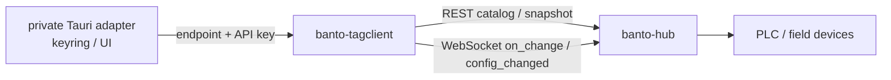
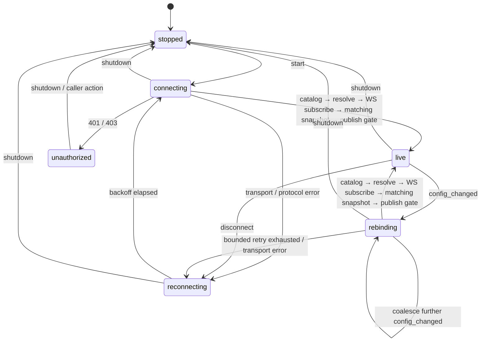

# banto-tagclient 設計

作成日: 2026-08-29
状態: **S1a完了、REST transportはS1b、WebSocket/workerはS2/S3で未実装**。上位レビュー反映
（2026-08-30）。S1aでは、読み取り専用DTO、Endpoint/Secret境界、stable ID resolverを実装した。
REST送信、Authorization、redirect、WebSocket、worker、再接続、書き込みは未実装である。
設計時参照baseline: `b9552627a86015b354b3c5651184fb108ba89e44`
実API確認日: 2026-08-30（`apps/banto-hub/core/src/rest.rs` / `stream.rs`）

---

## 0. 目的と非スコープ

`banto-tagclient` は、アプリケーションが banto-hub のcatalogから安定IDでタグを
解決し、現在値を取得・購読するための Rust crate である。PLC、Modbus、SLMPへは
直接接続しない。タグ定義と品質判定の一次ソースは常に banto-hub とする。

初版の対象は次に限る。

- RESTによるcatalogと明示タグの初期snapshot取得
- WebSocketによる`on_change`購読と`config_changed`検知
- stable IDを用いたbindingの解決・再解決
- 最新値優先のアプリ内状態配信と停止可能な接続ライフサイクル

次は初版の非スコープである。

- `WriteValue`、PLC直接接続、タグ設定の変更
- MQTT、gRPC、履歴照会、認可方式の変更
- OS keyring、Tauri command、画面、案件固有のタグ名・ID・接続設定
- 実機値が失われた場合のdemo値への自動フォールバック

## 1. 位置づけと境界



- `banto-tagclient` はTauri、Svelte、OS keyring、案件設定を知らない。
- private側adapterがkeyringからAPI keyを取得し、SDKへ渡す。SDKはkeyringを所有しない。
- API keyは `Authorization: Bearer <token>` ヘッダだけで送る。URL queryへ入れない。
- endpointは初版では`http`/`ws`のみとする（`https`/`wss`は別設計）。URLは
  userinfo、query、fragmentを必ず拒否し、HTTP redirectも追従しない。hostは空でない
  DNS名またはIP、portは省略または1..=65535、pathはorigin-formの絶対path（必要なら
  `/api/v1`等の固定prefix）だけを許可し、pathに資格情報を置かない。SDKは接続先の
  scheme/host/port/pathをこの境界内で固定してREST/WSを組み立てる。
- SDKから返す接続状態、値、未解決状態は、UIが現在値と誤認しないよう区別する。

## 2. transport選定

初版はREST + WebSocketを採用する。

| 用途                          | transport                  | 理由                                                                                                             |
| ----------------------------- | -------------------------- | ---------------------------------------------------------------------------------------------------------------- |
| catalog取得、明示タグの初期値 | REST                       | 再接続時も含め、要求と応答を明確に対応できる。                                                                   |
| 値の継続受信                  | WebSocket `on_change`      | 最新値を低遅延で更新できる。                                                                                     |
| binding再解決の契機           | WebSocket `config_changed` | stable ID bindingのrevision変更をHub変更なしで即時検知できる。                                                   |
| gRPC                          | 初版不採用                 | Hub側`ValueBatch`にrevision / `config_changed`相当がない。catalog pollingかproto拡張の設計が固まるまで保留する。 |

RESTだけの定期pollingは、rename・rebind・削除を検知するまでの遅延を作る。WebSocketの
`config_changed`を利用し、構成変更時だけcatalogを取り直すことで、この遅延を持ち込まない。

## 3. データ契約

### 3.1 binding

アプリは案件固有の外部名ではなく、次のstable IDとアプリ内のbinding keyを保存する。

```rust
pub struct StableTagId {
	pub connection_id: i64,
	pub group_id: i64,
	pub tag_id: i64,
}

pub struct BindingRequest {
	pub binding_key: String,
	pub stable_id: StableTagId,
}
```

`external_name`はcatalogから都度解決する表示用・購読用情報であり、bindingの同一性には
用いない。public文書・fixtureに案件固有のtag名、tag ID、接続情報を入れない。

要求`BindingRequest`の`binding_key`重複、stable ID三つ組の重複、catalog内のstable ID
重複は全てfail-closedとする。部分的にbindingを作らず、安定分類
`duplicate_binding_key` / `duplicate_requested_stable_id` / `duplicate_catalog_stable_id`
（実装では`invalid_bindings`または`invalid_catalog`の下位理由としてもよい）で返す。

### 3.2 値と未解決

```rust
pub enum ValueQuality {
	Good,
	Stale,
	Bad,
}

pub struct TagValueSnapshot {
	pub binding_key: String,
	pub numeric_value: Option<f64>,
	pub quality: ValueQuality,
	pub source_timestamp_ms: Option<i64>,
	pub received_at_ms: i64,
	pub catalog_revision: u64,
	pub run_id: Option<u64>,
	pub collection_mode: CollectionMode,
	pub value_source: ValueSource,
	pub unresolved: Option<UnresolvedReason>,
}
```

`numeric_value: None`、品質、時刻、未解決理由を混同しない。`received_at_ms`はSDKが受信した
時刻、`source_timestamp_ms`はHubから来た値の時刻である。再bindingに失敗した既存値は
保持してよいが、`unresolved`を設定してcurrent値として扱わない。

REST catalog DTOはHubの`revision`, `run_id`, `collection_mode`と各tagの`value_source`を
保持する。REST values/snapshot DTOも応答の`revision`, `run_id`, `collection_mode`と
各値の`value_source`を保持する（Hub実装のwire名はsnake_case）。値側entryの
`value_source`をauthoritativeな値源情報として保持し、catalog側の表示情報で上書きしない。

```rust
pub enum CollectionMode { Configured, AllSimulation, Unknown(String) }
pub enum ValueSource {
	Real,
	Simulation,
	DerivedSimulation,
	Internal,
	Unknown(String),
}
```

`value_source`の既知値は`real` / `simulation` / `derived_simulation` / `internal`。
未知値はraw値を保持した`Unknown(String)`として扱い、`Real`や実機のcurrentへ昇格させない。
`collection_mode`も未知値を`Unknown(String)`として保持するが、Unknownまたはcatalogと
valuesで異なる場合はcurrentを公開しない。catalogとvaluesは`revision`だけでなく
`run_id`（Optionの有無と値）と`collection_mode`も同一generationで一致しなければならない。
WS `data`にはrevision/source/run metadataがないため、最後に確定したREST snapshotの
metadataと、値側entryのauthoritativeな`value_source`をその接続世代へ固定する。
切断・再bindingでは必ずこのsnapshotを再取得し、旧世代のWS値を再利用しない。

## 4. 公開API案とエラー契約

APIは実装sliceで確定する。初版の候補は次のとおりである。

```rust
pub struct TagClientConfig { /* endpoint, API key, backoff */ }
pub struct TagClientHandle { /* latest state + worker owner */ }

impl TagClientHandle {
	pub async fn start(config: TagClientConfig, bindings: Vec<BindingRequest>)
		-> Result<Self, TagClientError>;
	pub fn latest(&self) -> LatestTagSnapshot;
	pub fn subscribe(&self) -> LatestSnapshotReceiver;
	pub async fn shutdown(self) -> Result<(), TagClientError>;
}
```

`SecretApiKey`は明示的なopaque wrapperとする。候補APIは
`SecretApiKey::new(String) -> Result<SecretApiKey, SecretError>`と、SDK内部だけが使う
`apply_authorization(request)`（Authorization bearer headerを設定する）であり、raw値を
返す`as_str`/`to_string`は提供しない。`Clone`, `Debug`, `Display`, `Serialize`,
`Deserialize`は実装せず、`TagClientConfig`やエラー、ログ、URLにも値を出さない。再利用が
必要なworker所有権は内部で限定的に管理し、呼出側へ複製可能なsecretを返さない。

エラーは文字列だけで判定しない。少なくとも次の安定分類を持たせる。

| 分類                            | 意味                                                             | 再試行                                                       |
| ------------------------------- | ---------------------------------------------------------------- | ------------------------------------------------------------ |
| `unauthorized`                  | 401/403または資格情報の拒否                                      | 無限高速再試行しない。呼出側が資格情報を更新して再開始する。 |
| `transport`                     | 接続、timeout、切断                                              | bounded exponential backoffで再接続する。                    |
| `protocol_error`                | 不正JSON、期待外メッセージ、契約違反                             | 接続を閉じ、backoff後にcatalogから再開する。                 |
| `catalog_unavailable`           | catalog取得不能                                                  | backoff後にcatalogから再開する。                             |
| `binding_unresolved`            | stable IDがcatalogで解決不能                                     | 接続は継続可能。対象値をcurrent扱いしない。                  |
| `revision_mismatch`             | catalogとvalues/snapshotのrevision不一致                         | bounded retry。整合するまでcurrentを公開しない。             |
| `runtime_metadata_mismatch`     | revision/run_id/collection_mode不一致、または未知collection_mode | bounded retry。整合するまでcurrentを公開しない。             |
| `duplicate_binding_key`         | 要求`binding_key`重複                                            | fail-closed。部分bindingを公開しない。                       |
| `duplicate_requested_stable_id` | 要求stable ID重複                                                | fail-closed。部分bindingを公開しない。                       |
| `duplicate_catalog_stable_id`   | catalog内stable ID重複                                           | fail-closed。部分bindingを公開しない。                       |
| `invalid_endpoint`              | 禁止scheme/URL部品、redirect応答                                 | 再試行せず設定を修正する。                                   |
| `stopped`                       | 呼出側の停止または正常shutdown                                   | 再接続しない。                                               |

`Debug`/`Display`、エラー、ログにtokenを含めない。endpointについてもhost以外のpathや
資格情報を露出しない。secret wrapperは値を常にredactする。

## 5. 状態機械と再接続



接続開始・再接続・rebinding後の新世代確立は、同じrace-free publish gateを通る。catalogを
取得してstable IDをresolveした後、先にWS接続とsubscribeを成立させる。WSの初期dataと
以後のdataは、無制限queueではなくbinding/tagごとに最新1件だけを保持するbounded pending
mapへcoalesceし、この時点ではcurrentへ公開しない。その後REST snapshot
を取得し、catalogとvaluesの`revision`、`run_id`、`collection_mode`が全て一致し、
collection_modeが既知で、要求したgeneration中に`config_changed`も`unknown_tag`も受信
していないことを確認して初めてsnapshotとpending WS dataを一括公開する。ただし公開時は
各値のsource timestamp `t`を比較し、同値時は受信順sequenceを使う安定規則でsnapshotより
古いpending値を破棄する。snapshotより新しいpendingだけをsnapshotへ重ね、単一snapshot
としてatomicに公開する。gate確認中に通知を
受信した場合、または不一致ならWS世代を破棄し、catalog取得からbounded retryする。これに
より「snapshot取得後からWS成立まで」に通知を取り逃がして旧bindingを公開する経路を持たない。

```mermaid
sequenceDiagram
	participant A as App
	participant C as banto-tagclient
	participant H as banto-hub
	A->>C: start(bindings)
	C->>H: GET catalog
	H-->>C: catalog + revision + run_id + collection_mode + value_source
	C->>C: stable ID resolve
	C->>H: WS connect / subscribe(on_change)
	H-->>C: initial data (buffer; do not publish)
	C->>H: GET explicit tag snapshot
	H-->>C: values + revision + run_id + collection_mode + value_source
	C->>C: require matching revision + run metadata + known mode
	C->>C: require no config_changed/unknown_tag during generation
	C->>C: compare (t, receive_seq); discard old pending; overlay newer pending
	C->>C: atomic publish one snapshot (snapshot + newer pending only)
	H-->>C: config_changed
	C->>C: invalidate current; enter rebinding and coalesce
	C->>H: GET catalog (bounded retry, from catalog each attempt)
	C->>C: re-resolve / WS subscribe (data buffered)
	C->>H: GET snapshot
	C->>C: require matching metadata / publish gate
```

`config_changed`受信時は直ちに`rebinding`へ遷移し、旧値をcurrent扱いしない。rebinding中に
同じまたは別revisionの通知が連打されても、通知をキューへ無制限に積まず「再解決が必要」
という一つのpending状態へcoalesceする。1回の試行は必ずcatalog取得から始め、stable IDを
再解決し、値snapshotのrevision、run_id、collection_modeがcatalogと一致した場合だけ新しい
購読・currentを公開する。publish gate中のWS値はbinding/tagごとの最新1件だけを保持し、
各値の`(source timestamp t, receive sequence)`を比較する。REST snapshotより古い、または
同値で安定規則上古いpendingは破棄し、新しいpendingだけをsnapshotへ重ねて一つのsnapshot
としてatomicに公開する。これによりWS初期dataがREST snapshotより古い場合に値を巻き戻さない。
`value_source`はvalues側entryをauthoritativeとして採用する。
不一致ならbounded retry（回数・待ち時間上限あり）し、上限到達時は`revision_mismatch`または
`runtime_metadata_mismatch`
または`reconnecting`としてcurrentを公開しない。対象が消えた場合は
`binding_unresolved`として値を保持してもcurrentにはしない。切断後もWebSocketだけを
張り直さず、必ずcatalogとsnapshotからやり直す。

## 6. バックプレッシャと所有権

- 値は最新値優先とする。内部状態はwatch相当のbounded latest snapshotで配る。
- publish gate中のWS dataは無制限queueにせず、binding/tagをキーとするbounded pending mapに
  最新1件だけを保持する。各entryはsource timestamp `t`と単調な受信sequenceを持ち、REST
  snapshotより古いpendingは公開前に破棄する。
- 遅いconsumerのための無制限queueは作らない。古い中間値は破棄可能である。
- `TagClientHandle`がworker task、socket、channelの所有者である。
- `shutdown().await`は停止通知、socket close、task joinを行う。失敗しても残留させず、
  Drop時は明示的にabortする方針を実装時に確定する。
- `shutdown`後に再接続taskやsocketが残らないことをテストする。

## 7. 依存と実装ゲート

S1aでレビュー済みの依存は、workspaceの`serde`/`serde_json`、`reqwest 0.13.4`
（`default-features = false`、URL型のみのため`json` featureなし）、
`zeroize 1.9.0`（derive featureなし）である。Cargo.lockにはこれらの既存package系列を
再利用し、S1a追加による新規package系列は増えていない。REST clientは手書きHTTP parserを避け、
S1bでreqwestを使う。手書きparserは
HTTP framing、redirect、timeout、header処理、認証の誤実装リスクを増やすため採用しない。

crate追加前に、次をレビューゲートとする。

1. `Cargo.lock`増分と依存グラフ
2. 各依存のlicenseと保守状況
3. Windows配布バイナリの増分
4. 既存workspace featureとの整合
5. Hubのrelease tagまたは互換commitへの固定方法

設計時点でtarget Hubのrelease tagは未定である。参照baselineは本書冒頭のcommitとし、
リリース互換commit/tagはSDK実装完了時に決める。

## 8. テスト計画

| テスト                       | 確認する契約                                                                                      |
| ---------------------------- | ------------------------------------------------------------------------------------------------- |
| catalog resolve              | stable IDから外部名・購読対象を解決できる。                                                       |
| unknown stable ID            | `binding_unresolved`になり、値をcurrent扱いしない。                                               |
| initial snapshot             | REST snapshotとWS初期dataでlatestが更新される。                                                   |
| race-free publish gate       | WSを先に成立させ、snapshot後の通知取り逃しを防ぎ、gate確認前のdataを公開しない。                  |
| handshake buffer latest-wins | pending mapはbinding/tagごとに最新1件だけを保持し、snapshotより古いWS frameは上書きせず破棄する。 |
| config_changed rename/rebind | rebinding中は旧値を無効化し、通知連打をcoalesceして一度だけ再解決する。                           |
| revision一致ゲート           | catalogとvalues/snapshotのrevision不一致を公開せず、catalogからbounded retryする。                |
| runtime metadata一致         | revision/run_id/collection_modeを同一generationとして検証し、未知mode・不一致をfail-safeにする。  |
| value_source未知値           | `Unknown(raw)`で保持し、実機値/`Real`と誤認しない。                                               |
| duplicate拒否                | binding_key、要求stable ID、catalog stable IDの重複をfail-closedにする。                          |
| endpoint boundary            | userinfo/query/fragment、禁止scheme、redirectを拒否する。                                         |
| disconnect/reconnect         | bounded backoff後、catalog/snapshotから接続を再構築する。                                         |
| 401/403                      | `unauthorized`になり、高速無限再試行しない。                                                      |
| malformed JSON               | `protocol_error`に分類し、secretを出さず回復経路へ入る。                                          |
| backpressure/latest-wins     | 遅いconsumerでもqueueが無制限に増えず、最新値を観測できる。                                       |
| shutdown                     | task、socket、channelが残留しない。                                                               |
| secret redaction             | Debug/Display/エラー/ログへtokenやendpoint pathを出さない。                                       |

## 9. 実装sliceと完了条件

| slice | 内容                                                           | 完了条件                                                                                                                                                                                  |
| ----- | -------------------------------------------------------------- | ----------------------------------------------------------------------------------------------------------------------------------------------------------------------------------------- |
| S1a   | crate骨格、共通DTO、SecretApiKey、Endpoint、stable ID resolver | URL境界・redaction・metadata保持・unknown値保持・重複fail-closed・catalog resolveテストが通る。REST送信、Authorization、redirect処理は含めない。                                          |
| S1b   | REST catalog/values transport、Authorization、redirect拒否     | reqwestによる読み取り専用GET、認証ヘッダ、redirectを追従しない設定、HTTPエラー分類のテストが通る。                                                                                        |
| S2    | WS購読、latest snapshot、状態機械                              | WS先行接続、bounded pending map、handshake buffer latest-wins、older WS frame does not overwrite REST snapshot、race-free publish gate、on_change、backpressure/latest-winsテストが通る。 |
| S3    | config_changed、rebinding/coalesce、再解決、再接続、shutdown   | snapshot後の通知取り逃しなし、revision/run metadata不一致retry、coalesced rebind、旧値無効化、401/403、切断復旧、残留なしテストが通る。                                                   |
| S4    | workspace統合と互換性固定                                      | 依存レビュー、fmt/clippy/test、Hub互換commit/tagの記録が完了する。                                                                                                                        |

初版のDefinition of Doneは、全テスト表を自動化し、書き込み・PLC直結が存在せず、
demoへの自動fallbackがなく、認証情報が全観測可能面からredactされ、停止後にworkerが
残らないこととする。Hub本体・既存app/crate実装は変更せず、manifest/lockfileは承認済み追加のみとし、
新規依存は別レビューで承認されるまで追加しない。
